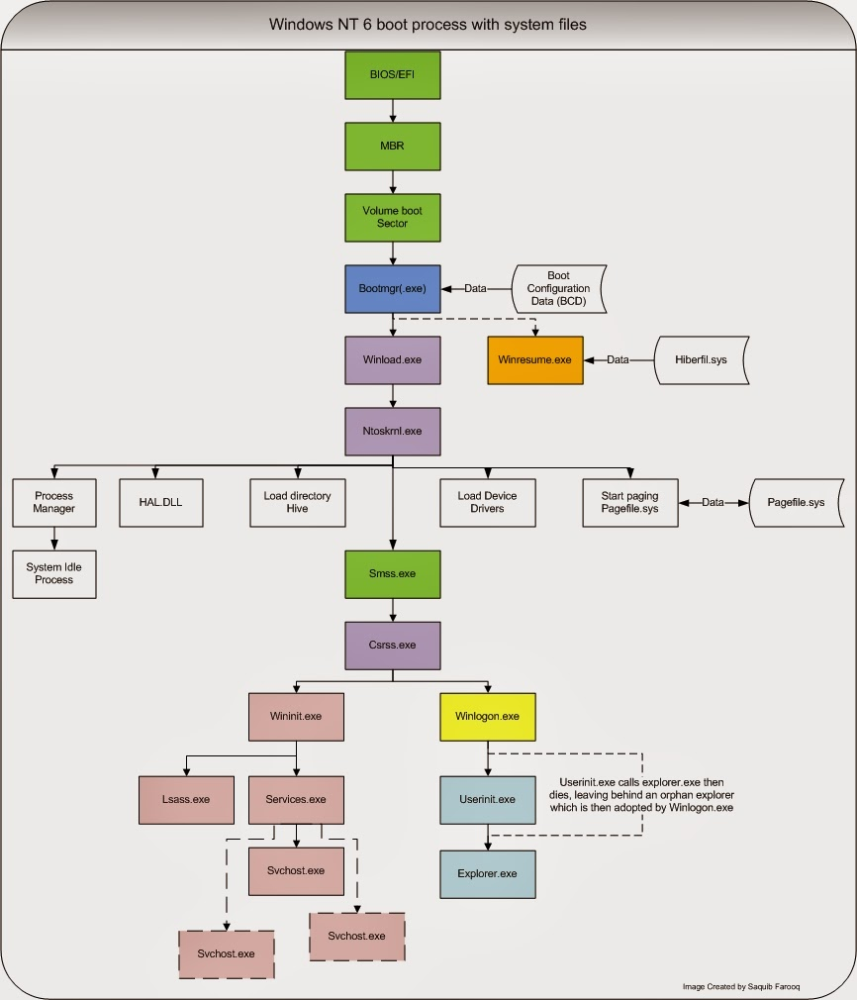
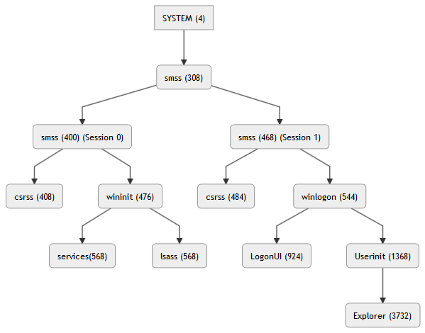

# Windows Boot Process

## Boot Process Overview


## Why Do we care about the Boot process?

   - **Rootkits** are a type of malware that hide themselves and other applications. They typically run in kernel mode, so they have the same privileges as the operating system and can sometimes start before it. Because traditionally, anti-malware software doesn’t load until after the kernel and boot drivers do, rootkits often exploit weaknesses in the startup process:

   - **Firmware Rootkits** overwrite the PC’s BIOS or other hardware firmware so the rootkit can start before the OS even loads

   - **Bootkits** replace the OS bootloader to load the bootkit before the OS

   - **Kernel rootkits** replace a portion of the OS kernel so the rootkit can start when the OS loads

   - **Driver rootkits** pretend to be a boot driver that the OS uses to communicate with PC

   - **Avenues of Attack** An exposed operating system can be easily used to further Offensive goals such as pivots or compromised to steal data

# BIOS and UEFI

**BIOS** and **UEFI** are **firmware** that ensure critical hardware like SATA devices (Hard Drives), Display Adapters, and SDRAM(Synchronous dynamic random-access memory) are functional then, locates the MBR(Master Boot Record) or GPT(GUID Partition Tables).

**Firmware** is software coded non-volatile memory devices such as:

   - ROM (Read only memory)

   - EPROM (Electronically Programmable Read only memory)

   - EEPROM (Electronically Erasable Programmable read only memory)

   - Flash memory

BIOS and UEFI do the same thing, but minor differences make UEFI more popular than BIOS in the current day. Without getting into low level specifics some of the benefits of UEFI:

   - UEFI Boots much faster than BIOS systems, especially for Windows machines.

   - UEFI Firmware is usually loaded into flash memory or EEPROM, making it easier to update and patch.

   - UEFI offers SECURED BOOT mode which only allows verified drivers to load.

   - UEFI offers drive support of up to 9 zettabytes, while BIOS only works with 2 terabytes.

[References for UEFI Features](https://en.wikipedia.org/wiki/Unified_Extensible_Firmware_Interface#Features)

## BIOS Master Boot Record

Once the **BIOS** checks hardware, it finds the **MBR** (Master Boot Record). The **MBR** contains Disk Partitions like `/dev/sda1` or `DISK 1 C:\`

The partition contains code that starts the first stage of loading an Operating System, called a **Boot Loader**

   - Boot Loaders

       - Windows 2003 and older used **NTLDR** or New Technology Loader

       - Windows 7 Service Pack 1 and newer uses **bootmgr** or New Technology Loader

From this point the **Boot Loader** takes over and starts the **Operating System**

## UEFI Boot Manager

**UEFI** does the same hardware checks as **BIOS**, but instead of using the MBR it reads an **EFI Partition**. The EFI Partition contains **UEFI Boot Managers**

    Windows **bootmgfw.efi** or Windows Boot Manager

From this point onwards, the **UEFI Boot Manager** takes over and starts the **Operating System**

### Detecting BIOS or UEFI on Windows

Q: How can I tell if my machine is running BIOS or UEFI?
```
findstr /C:"Detected boot environment" "C:\Windows\Panther\Setupact.log"
Get-Content C:\Windows\Panther\Setupact.log | Select-String "Detected boot environment"
```
Use the bcedit command
```
bcdedit | findstr /i winload
```
**winload.exe = BIOS, winload.efi = UEFI**

Check the GUI
```
Msinfo32.exe
```

# Windows System Initialization

This is a simplified version of the Windows Boot Process from the kernel (ntoskrnl.exe) to the execution of LogonUi.exe (the process that prompts for user interaction). It is broken into five steps.

   - Loading the Operating System Kernel
   - Initializing the Kernel
   - Starting Subsystems
   - Starting Session 0
   - Starting Session 1

## Loading the Operating System Kernel

***On UEFI Systems***

`bootmgfw.efi` reads a **BCD** (Boot Configuration Data) located in the EFI system partition to load the file `winload.efi`

***On BIOS Systems***

`bootmgr` or `NTLDR` reads the file `\Boot\BCD` to locate `winload.exe`

   - The purpose of both `winload` programs is to load basic drivers and start the next part of the Windows Boot Process - loading the **Kernel**.

**Winload.exe** loads the Windows kernel:

   - Loads essential drivers required to read data from disk

   - Loads the windows kernel (`ntoskernel.exe`) and dependencies

**Winresume.exe** reads previously saved data from hiberfil.sys (`hibernation mode`) to restore a previous Windows instance.

    On UEFI systems, `winresume.exe` is named `winresume.efi`, and is located at `\windows\system32\boot`.

## Initializing the Kernel

The kernel, as previously discussed, is the **heart** of the Operating System. Without it, the system cannot function.

In Windows, the kernel is named `Ntoskrnl.exe` and is a critical system file. It does the following tasks during the boot process:

   - Loads the Windows Registry

   - Loads device drivers

   - Starts the system pagefile located at `C:\pagefile.sys`

   - Loads `hal.dll`

       - `hal.dll` provides abstraction between hardware interfaces and `Ntoskrnl.exe`

Once the kernel is done loading it spawns `System` which hosts threads that only run in kernel mode responsible things like drivers. `System` then spawns the session management processes `smss.exe` and `csrss.exe`
​
# Starting Subsystems

`smss.exe` (**Session Manager Subsystem**) does the following tasks:

   - Loads environmental variables like `%APPDATA%` and `%COMPUTERNAME%`

   - Populates the pagefile located in `C:\pagefile.sys`

   - **Starts the kernel and user mode sub systems.**

   - Starts a `csrss.exe` to manage processes and threads for each **User Subsystem**.

​
## Kernel Subsystems

The kernel subsystem creates and manages every resource available to Windows by interacting with drivers on the system. It controls things like:

   - System power state

   - Process creation and threads

   - Graphical rendering

   - Access Control Lists via the Security Reference Monitor

It is important to understand - **users cannot interact directly with any kernel-mode process or even see them**

## User Subsystems

The user subsystem manages all user applications like process creation, internet connectivity, and object access through API calls to `hal.dll`

User Subsystems run in **Session 0** and **Session 1**



### User Subsystem Session 0

Session 0 is for security and high privilege processes such as services. They are run in a separate session to isolate them from individual user’s processes.

    - `smss.exe` installs the Win32 subsystem kernel and user mode components (win32k.sys - kernel; winsrv.dll - user; and csrss.exe - user.)

       - `csrss.exe` - The Client/Server Runtime Subsystem supports process / thread creation and management.

       - `wininit.exe` marks itself as critical, initializes the Windows temp directory, loads the rest of the registry, and starts user mode scheduling. It also installs programs that require a reboot to finish the install process. **It also starts**:

           - `lsm.exe` - the **Local Session Manager (LSM)** handles all sessions of a system (both remote desktop sessions and local system sessions.)

           - `lsass.exe` - the **Local Security Authority Subsystem (LSASS)** provides user authentication services, manages the local security policy, and generates access tokens.

           - `services.exe` the **Services Control Manager (SCM)** loads AutoStart services, using LSASS to authenticate if they run as something other than System.

        - `wininit.exe` then waits for system shutdown to undo everything it started.

By why does any of this matter?

   - Processes in **User Subsystem Session 0** are created using the highest permissions available to a User in Windows - `SYSTEM`

       - `System` has more permissions than an administrative account

       - represents the Windows Operating System

       - *Can be tricked into executing malicious commands via `services`

[Mitre ATT&CK: System Services](https://attack.mitre.org/techniques/T1569/)

[Mitre ATT&CK: Hijack Execution Flow: Services Registry](https://attack.mitre.org/techniques/T1574/011/)

**Showing the Spooler Service using SC**
```
sc query spooler

SERVICE_NAME: Spooler
DISPLAY_NAME: Print Spooler
        TYPE               : 110  WIN32_OWN_PROCESS  (interactive)
        STATE              : 4  RUNNING
                                (STOPPABLE, NOT_PAUSABLE, IGNORES_SHUTDOWN)
        WIN32_EXIT_CODE    : 0  (0x0)
        SERVICE_EXIT_CODE  : 0  (0x0)
        CHECKPOINT         : 0x0
        WAIT_HINT          : 0x0
```

**Showing the Service Control Manager registry key**
```
reg query HKEY_LOCAL_MACHINE\SYSTEM\CurrentControlSet\Services | findstr Spooler

HKEY_LOCAL_MACHINE\SYSTEM\CurrentControlSet\Services\Spooler
```

**Showing the contents of the Spooler Service Registry Key**
```
reg query HKEY_LOCAL_MACHINE\SYSTEM\CurrentControlSet\Services\Spooler

HKEY_LOCAL_MACHINE\SYSTEM\CurrentControlSet\Services\Spooler
    DisplayName    REG_SZ    @%systemroot%\system32\spoolsv.exe,-1
    Group    REG_SZ    SpoolerGroup
    ImagePath    REG_EXPAND_SZ    %SystemRoot%\System32\spoolsv.exe 
    Description    REG_SZ    @%systemroot%\system32\spoolsv.exe,-2
    ObjectName    REG_SZ    LocalSystem 
```
-	The spooler service executable. What happens if someone changes that to a malicious binary?
-	The account who runs the Spooler Service!

### User Subsystem Session 1

Session 1 is for the first interactive user (note: each session gets its own copy of csrss.exe.) Session 1 and up are standard user sessions. This includes everyone from the default `Administrator` to custom accounts created. It is the entire desktop experience on Windows.

It does the following, in order, for Session 1 and up:

   - Spawn a Session 1 ( or higher) `csrss.exe`

   - Spawn `Winlogon.exe` which by default prompts for credentials with `logonui.exe`

   - Spawn `userinit.exe` which creates an account token and creates a custom environment

   - Spawn `explorer.exe` as the customized graphical environment.

***Why does any of this matter?***

**Hundreds** of Processes in **User Subsystem Session 1 and up** are started automatically as a standard user to include administrative accounts. This potentially opens up the system to vulnerabilities such as:

   - [Mitre ATT&CK: Boot or Logon AutoStart Execution via Registry Keys](https://attack.mitre.org/techniques/T1547/001/)

   - [Mitre ATT&CK: Boot or Logon Initialization Scripts](https://attack.mitre.org/techniques/T1037/001/)

   - [Mitre ATT&CK: PowerShell Profile Script Execution](https://attack.mitre.org/techniques/T1546/013/)

The potential damage of these vulnerabilities is limited to the permissions of the account it executed on.

# Windows BCDEdit Demo

**Q: What can I do if the Windows boot settings became corrupted?**

**A: Fix it with the bcdedit command**
*BCDEdit command help*
```
c:\demo>bcdedit /?
```
**What does a normal bcdedit output look like?**
```
c:\demo>bcdedit

Windows Boot Manager
--------------------
identifier              {bootmgr}
device                  partition=C:
description             Windows Boot Manager
locale                  en-US
inherit                 {globalsettings}
default                 {current}
resumeobject            {2bd08882-0f8f-11e9-94b6-0002c9550dce}
displayorder            {current}
toolsdisplayorder       {memdiag}
timeout                 29

Windows Boot Loader
-------------------
identifier              {current}
device                  partition=C:
path                    \windows\system32\winload.exe
description             Windows 7 - Tiger Paw
locale                  en-US
inherit                 {bootloadersettings}
recoverysequence        {91061b50-0fa8-11e9-aa6e-00155d49334a}
displaymessageoverride  Recovery
recoveryenabled         Yes
allowedinmemorysettings 0x15000075
osdevice                partition=C:
systemroot              \windows
resumeobject            {2bd08882-0f8f-11e9-94b6-0002c9550dce}
nx                      OptIn
bootmenupolicy          Standard
```

**Backup & Restore Current BCD settings**
```
c:\demo>bcdedit /export C:\Lion_BCD
c:\demo>bcdedit /import C:\Lion_BCD
```
   - Whenever you want to make a change to a specific Boot Loader entry use the `{Identifier}`

**Modify Description of Current Boot loader**
```
c:\demo>bcdedit /set {<identifier>} description "Windows 7 - Lion Den" (1)
```
**Create New partition**
```
c:\demo>bcdedit /create {ntldr} /d "Windows XP Pro SP2 - Tiger Paw"
```
**-Specify the Partition**
```
c:\demo>bcdedit /set {ntldr} device partition=C:
```
**-Specify the Path to ntldr**
```
c:\demo>bcdedit /set {ntldr} path \ntldr
```
**-Specify the Display Order**
```
c:\demo>bcdedit /displayorder {ntldr} /addfirst
```
**Now Show the added Partition**
```
c:\demo>bcdedit

Windows Boot Manager
--------------------
identifier              {bootmgr}
device                  partition=C:
description             Windows Boot Manager
locale                  en-US
inherit                 {globalsettings}
default                 {current}
resumeobject            {2bd08882-0f8f-11e9-94b6-0002c9550dce}
displayorder            {ntldr}
                        {current}
toolsdisplayorder       {memdiag}
timeout                 29

Windows Legacy OS Loader
------------------------
identifier              {ntldr}
device                  partition=C:
path                    \ntldr
description             Windows XP Pro SP2 - Tiger Paw

Windows Boot Loader
-------------------
identifier              {current}
device                  partition=C:
path                    \windows\system32\winload.exe
description             Windows 7 - Lion Den
locale                  en-US
inherit                 {bootloadersettings}
recoverysequence        {91061b50-0fa8-11e9-aa6e-00155d49334a}
displaymessageoverride  Recovery
recoveryenabled         Yes
allowedinmemorysettings 0x15000075
osdevice                partition=C:
systemroot              \windows
resumeobject            {2bd08882-0f8f-11e9-94b6-0002c9550dce}
nx                      OptIn
bootmenupolicy          Standard
```

**Delete the Legacy Operating System ( /f = force)**
```
bcdedit /delete {ntldr} /f
```
#### Add, Remove & Change Additional Options

   - Add Safeboot Value
```
_Output_Truncated_
Windows Boot Loader
-------------------
identifier              {current}
device                  partition=C:
path                    \windows\system32\winload.exe
description             Windows 7 - Tiger Paw
locale                  en-US
inherit                 {bootloadersettings}
recoverysequence        {91061b50-0fa8-11e9-aa6e-00155d49334a}
displaymessageoverride  Recovery
recoveryenabled         Yes
allowedinmemorysettings 0x15000075
osdevice                partition=C:
systemroot              \windows
resumeobject            {2bd08882-0f8f-11e9-94b6-0002c9550dce}
nx                      OptIn
safeboot                Minimal
bootmenupolicy          Standard
```
```
bcdedit /deletevalue {current} safeboot (1)
bcdedit /set {bootmgr} timeout 29 (2)
```
(1) Will delete the Safeboot value

(2) Will change the Timeout Value