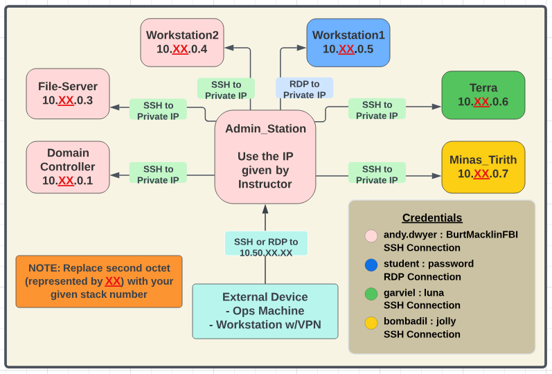

# Range 
Details about the range itself are below

## Range Map


## Range IPs
| Host | IP Address |
|---|---|
| Admin Station | 10.10.0.2 |
| fileServer | 10.10.0.3 |
| dc | 10.10.0.10 |
| workstation2 | 10.10.0.4|
| workstation1 | 10.10.0.5 |
| terra | 10.10.0.6 |
| minas | 10.10.0.7 |

### PowerShell Commands and Arguments
```
Get-Content -Path "C:\Test Files\content.txt"                                         # Displays the contents of the file
Get-Variable                                                                          # Displays current Variables
Get-Verb                                                                              # List the PowerShell verbs
Get-Command                                                                           # List the PowerShell cmdlets
Get-Command -Type Cmdlet | Sort-Object -Property Noun | Format-Table -GroupBy Noun    # Get cmdlets and display them in order
Get-Command -Module Microsoft.PowerShell.Security, Microsoft.PowerShell.Utility       # Get commands in a module
```
### PowerShell Help
```
Get-Help <cmdlet>                                                 # Displays help about a PowerShell cmdlet
Get-Help get-process                                              # Displays help for Get-Process cmdlet
Get-Help get-process -online                                      # Opens a web browser and displays help for the Get-Process cmdlet on the Microsoft website
Get-History <like Linux will return previous entered commands.>   # Displays history of commands in current window
Get-Location <similar to PWD on Linux, gl is the alias.>          # Displays present working directory
```
### PowerShell Object Properties
```
Get-Process | Get-Member                       # Gives the methods and properties of the object/cmdlet
(cmdlet).property                              # Command Structure
(Get-Process).Name                             # Returns the single property of 'name' of every process
Start-Process Notepad.exe                      # This cmdlet uses the Process.Start Method of the System.Diagnostics.Process class to open notepad.exe
Stop-Process -name notepad                           # This cmdlet uses the Process.Kill Method of the System.Diagnostics.Process class to stop notepad.exe
Get-Process | Select-Object Name, ID, path     # Displays the Get-Process Properties of 'Name, ID, Path' for every process
Get-Help Format-Table
Get-Help Format-List
```
### Pipelined Variables
```
Get-Process | Select-Object Name, ID, path | Where-object {$_.ID -lt '1000'}            # List all the processes with a PID lower than 1000
(Get-Process | Select-Object Name, ID, path | Where-object {$_.ID -lt '1000'}).count    # List all the processes with a PID lower than 1000
```

### CIM Classes
```
Get-Cimclass *                                                                  # Lists all CIM Classes
Get-CimInstance –Namespace root\securitycenter2 –ClassName antispywareproduct   # Lists the antispywareproduct class from the root/security instance
Get-CimInstance -ClassName Win32_LogicalDisk -Filter “DriveType=3” | gm         # Shows properties and methods for this Instance
Get-WmiObject -Class Win32_LogicalDisk -Filter “DriveType=3”                    # Using the Windows Management Instrumentation method
Get-CimInstance -class Win32_BIOS                      # Queries Win32_Bios
Get-WmiObject -Class Win32_BIOS                        # same output but deprecated command
```

### PowerShell Scripts

#### PowerShell Loops
```
Get-Help about_For
Get-Help about_Foreach
Get-Help about_While
Get-Help about_Do
```
##### For Loops
```
for (<Init>; <Condition>; <Repeat>)
{
    <Statement list>
}

$array = ("item1", "item2", "item3")
for($i = 0; $i -lt $array.length; $i++){ $array[$i] }
item1
item2
item3
```
##### Foreach Loop
```
$letterArray = "a","b","c","d"
foreach ($letter in $letterArray)
{
  Write-Host $letter
}

foreach ($file in Get-ChildItem)
{
  Write-Host $file
}
```

##### While Loop
```
while (<condition>){<statement list>}

while($val -ne 3)
{
    $val++
    Write-Host $val
}
#or
while($val -ne 3){$val++; Write-Host $val}
```

#### Conditions
```
if ($a -gt 2) {
    Write-Host "The value $a is greater than 2."
}
elseif ($a -eq 2) {
    Write-Host "The value $a is equal to 2."
}
else {
    Write-Host ("The value $a is less than 2 or" +
        " was not created or initialized.")
}
```

#### Variables
```
Get-Variable                      # Names are displayed without the preceding <$>
Clear-Variable -Name MyVariable   # Delete the value of a Variable
Remove-Variable -Name MyVariable  # Delete the Variable

$MyVariable = 1, 2, 3             # Creates the MyVariable with 1,2,3

$Processes = Get-Process          # Creates a Variable with the results of Get-Process
$Today = (Get-Date).DateTime      # Creates a combined Date/Time variable from the results of Get-Date

$PSHome | Get-Member              # Displays System.String with it's objects and properties
$A=12                             # Creating A with an integer
$A | Get-Member                   # Displays System.Int32
```

#### Arrays
```
# Creating an Array

$A = 22,5,10,8,12,9,80

# Calling the Array

C:\PS> Echo $A
22
5
10
8
12
9
80

# Creating an Array with '..'

$A[1..4]
C:\PS> Echo $A
1
2
3
4

# ForEach loop to display the elements in the $A array

$A = 0..9
foreach ($element in $A) {
  $element
}
#output
0
1
2
3
4
5
6
7
8
9

# For loop to return every other value in an array

$A = 0..9
for ($i = 0; $i -le ($a.length - 1); $i += 2) {
  $A[$i]
}
#output
0
2
4
6
8

# While loop to display the elements in an array until a defined condition is no longer true

$A = 0..9
$i=0
while($i -lt 4) {
  $A[$i];
  $i++
}
#output
0
1
2
3
```