# Range Diagram
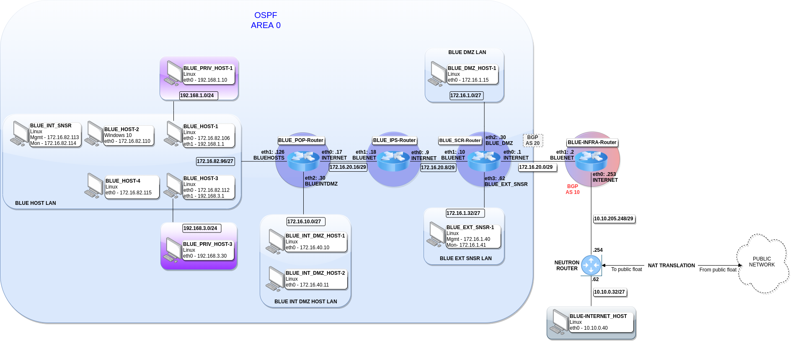

# OSI Model Diagram
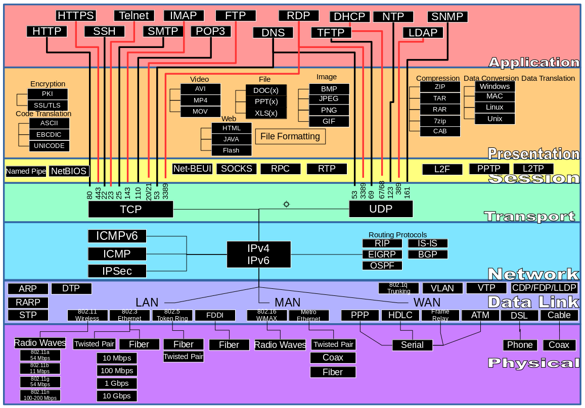

## Internet Standards Organizations

Other than the OSI or TCP/IP models, it’s also important to understand some other organizations that have been developing Internet and Networking Standards.

   - Internet Engineering Task Force (IETF): The IETF is a large open international community of network designers, operators, vendors, and researchers who are concerned with the evolution and operation of the Internet. It focuses on the development of protocols and standards, with working groups dedicated to specific areas such as routing, security, and web technologies.

       - Main focus: repository of Request for Comment (RFC) which is a series of documents published by the Internet Engineering Task Force (IETF) and other organizations involved in the development of Internet standards and protocols. RFCs serve as the primary means for documenting specifications, protocols, procedures, and other technical aspects of the Internet.

       - Noteable RFCs:

           - RFC 768 - User Datagram Protocol (1980): This RFC defines the User Datagram Protocol (UDP), a core protocol used for low-latency communications where reliability is not a priority.

           - RFC 791 - Internet Protocol (1981): This RFC defines IPv4, the fourth version of the Internet Protocol. It’s foundational for the functioning of the modern Internet.

           - RFC 792 - Internet Control Message Protocol (1981): Defines ICMP, used for network diagnostics and error reporting (e.g., echo requests/replies).

           - RFC 793 - Transmission Control Protocol (1981): Defines TCP, including its connection-oriented features, reliability mechanisms, and flow control.

           - RFC 826 - Address Resolution Protocol (1982): Defines the Address Resolution Protocol (ARP), which is used to map IP addresses to MAC addresses in a local network.

           - RFC 854 - Telnet Protocol Specification (1983): Defines the Telnet protocol, which allows remote text-based communication over the Internet.

           - RFC 959 - File Transfer Protocol (FTP) (1985): Specifies the FTP protocol for transferring files between clients and servers.

           - RFC 1350 - Trivial File Transfer Protocol (TFTP) (1992): Defines TFTP, a simpler and less feature-rich file transfer protocol compared to FTP.

           - RFC 1918 - Address Allocation for Private Internets (1996): This RFC defines the private IP address ranges used within internal networks that are not routable on the public Internet.

           - RFC 1939 - Post Office Protocol - Version 3 (POP3) (1996): Defines POP3, a protocol for retrieving email from a server.

           - RFC 2131 - Dynamic Host Configuration Protocol (1997): Specifies DHCP for dynamically assigning IP addresses and other network configuration parameters to devices.

           - RFC 2460 - Internet Protocol, Version 6 (IPv6) Specification (1998): This RFC specifies IPv6, the successor to IPv4, designed to address limitations and exhaustion issues with IPv4.

           - RFC 3501 - Internet Message Access Protocol (IMAP) (2003): Specifies IMAP, a protocol for accessing and managing email on a server.

           - RFC 4251 - The Secure Shell (SSH) Protocol Architecture (2006): Describes the architecture of SSH, including its components for secure remote access and file transfer.

           - RFC 5321 - Simple Mail Transfer Protocol (2008): Defines SMTP for email transmission between servers.

Institute of Electrical and Electronics Engineers (IEEE): While the IEEE is a broader organization covering various fields of technology, it plays a significant role in developing standards for networking and communication technologies. The IEEE 802 working groups, for example, have developed standards for LANs and wireless networks.

   - Some of the standards they deal with:

       - IEEE 802.11: Wireless LAN standards, commonly known as Wi-Fi, specifying protocols for wireless communication between devices.

       - IEEE 802.3: Ethernet standards, defining specifications for wired local area network (LAN) communication.

       - IEEE 802.1Q: Virtual LAN (VLAN) standards, providing protocols for creating and managing virtual LANs within Ethernet networks.

       - IEEE 802.16: Broadband Wireless Access (BWA) standards, often referred to as WiMAX, for wireless metropolitan area networks (MANs).

       - IEEE 802.1X: Port-based network access control standards, used for authenticating and authorizing devices connecting to a LAN or WLAN.

       - IEEE 802.1ad: Provider Bridging (PB) standards, also known as "Q-in-Q," for implementing virtual LAN (VLAN) stacking in Ethernet networks.

## Decimal to Hexadecimal Conversion

When converting Decimal to Hexadecimal (or converting Hexacedimal to Decimal) it is easiest to convert to 8-bit, 16-bit, or 32-bit binary first.

   - Convert from Decimal to Hex

       - Convert the decimal number to its binary equivalent.

           - 0 - 255 will be contained within 1 byte

           - 256 - 65,535 will be contained within 2 bytes.

           - 65,536 - 4,294,967,296 will be contained within 4 bytes.

       - Split the byte(s) into 4-bit nibbles with values of 8, 4, 2, and 1 for each nibble.

           - 1 byte will have 2 nibbles, 2 bytes with have 4 nibbles, and 4 bytes will have 8 nibbles.

       - Convert the values of each 4-bit nibble back into decimal

           - Each nibble of 4 bits will give you a value from 0 to 15.

           - 10 = A, 11 = B, 12 = C, 13 = D, 14 = E, and 15 = F

       - Order each hexadecimal digit in order from left to right.

       - The symbol of 0x is placed in front of the value to designate it as a hexidecimal number.

   - Convert from Hex to Decimal

       - Align each Hex digit to the bit chart

           - 2 Hex to 1-byte, 4 Hex to 2-bytes, 8 hex to 4-bytes.

           - The leftmost Hex will align with the High order bits while the rightmost Hex will align with the lowest-order bits.

       - Convert each Hex to its decimal equivalent.

           - A = 10, B = 11, C = 12, D = 13, E = 14, F = 15

       - Convert each decimal to its binary equivalent and place into each 4-bit nibble.

       - Add up all the bits that are turned on.

           - 1 byte will return values from 0 - 255

           - 2 bytes will return values from 256 - 65,535

           - 4 bytes will return values from 65,536 - 4,294,967,296

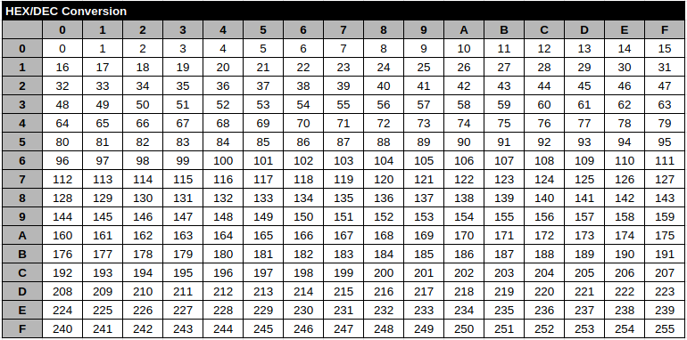

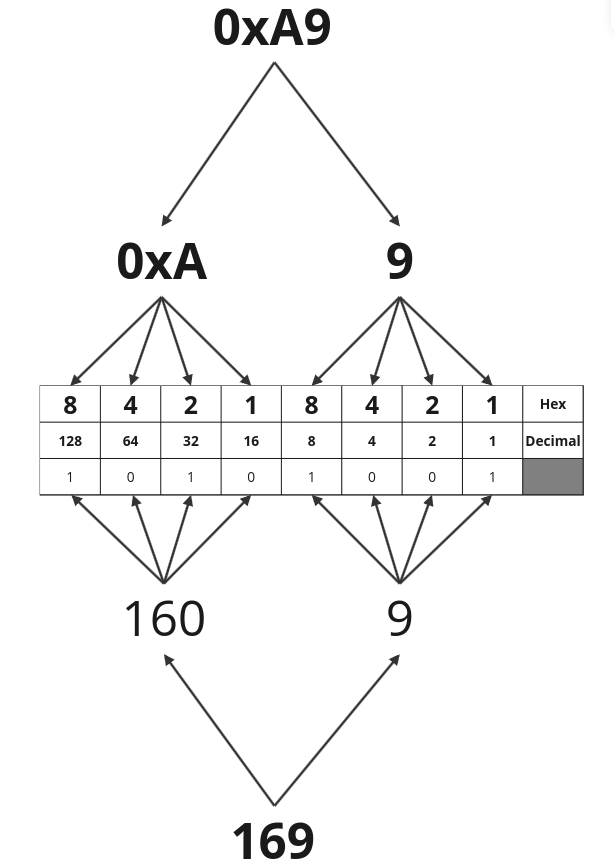

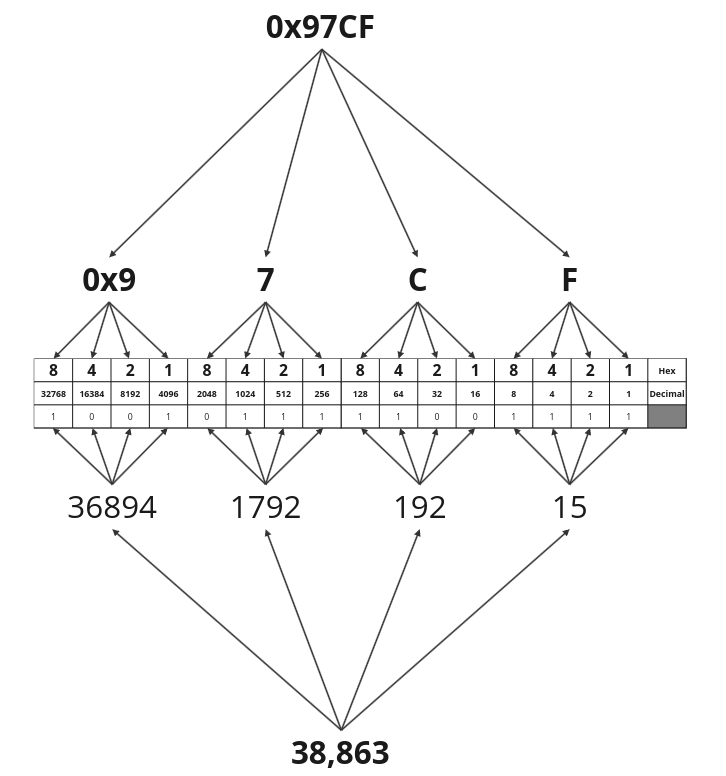

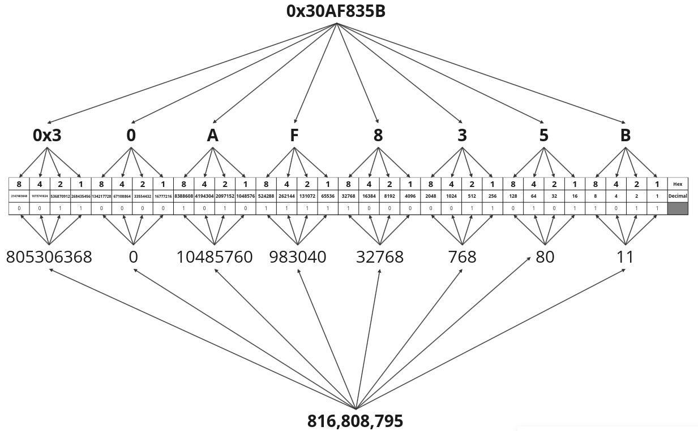

   - Tetrasexagesimal (Base 64)

       - This system is conveniently coded into ASCII by using the 26 letters of the Latin alphabet in both upper and lower case (52 total) plus 10 numerals (62 total) and then adding two special characters

   - Common Format

       - Base 64 - Like HEX, it allows groupings up to 6-bits of binary (0-63 decimal).

       - Characters used are (A-Z), (a-z), (0-9), and (+, /). That is (26) + (26) + (10) + (2) respectively.

       - In order to be compatible with binary, it uses 4 groupings of 6-bits (24 total bits) so that it will equate to 3 bytes of binary ( 24 bits).

       - For data not consuming the full 24-bits, it will use "=" signs for each 6 unused bits at the end as padding. Not more than 2 "=" will be used.

       - MTI=, MTIzNA==, MTIzNDU2Nzg=, QmFzZSA2NA==


## Encapsulation and Decapsulation

   - The communication between every layer other than the Physical layer is logical in nature. Therefore in order to pass information between protocol layers a protocol data unit (PDU) must be used. Each PDU for each protocol layer has specifications for the features or requirements at its layer. The PDU is passed down to a lower layer for transmission, the next lower layer is providing the service of handling the previous layer’s PDU. This is why the previous layer’s PDU is now referred to as an service data unit (SDU).

       - Protocol Data Units for each OSI Layer:

           - Application, Presentation, and Session = Data

           - Transport = Segment (TCP) or Datagram (UDP)

           - Network = Packet

           - Data Link = Frame

           - Physical = Bits

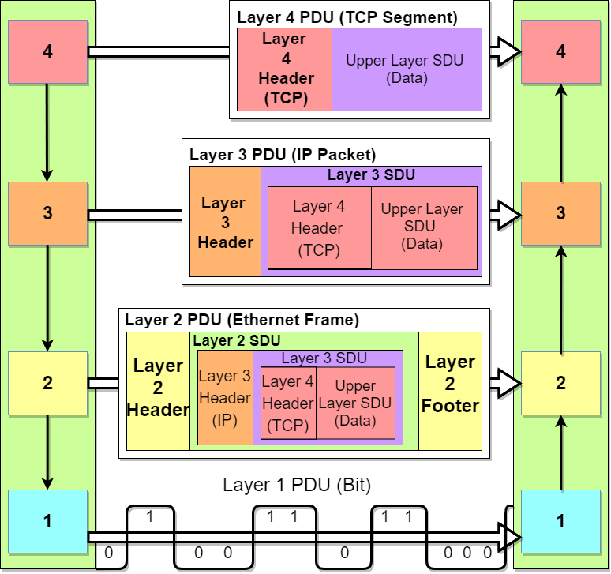

1.3.4.1 MAC Spoofing

    Spoofing is the act of disguising a communication from an unknown source as being from a known or trusted source. Spoofing is an attack vector done at several different layers of the OSI. At the Data-link layer attackers will commonly spoof the MAC-address.

    Originally MAC addresses were hard coded into the firmware of the NIC and could not be easily changed. This is why MAC addresses were commonly called "Firmware", "Hardware", or "Burned-in" addresses. In order to facilitate MAC spoofing attacks it required crafting of special frames with the MAC address pre-programmed in.

    Today most MAC addresses are programmed using the software. This makes modification of a device’s MAC address much simpler. In order to perform a MAC spoofing attack the malicious actor can either change their MAC address to a known or trusted address or create crafted frames with the MAC address already programmed in. MAC spoofing can be used to perform:

## How MAC Spoofing Works

   - Changing MAC Address: The attacker modifies their device’s MAC address to match that of another device, such as an authorized network device. This can often be done using software tools or by altering network interface settings on the device.

       - Linux: Use `ifconfig` or `ip link set dev eth0 address XX:XX:XX:XX:XX:XX` to change the MAC address.

       - Windows: Use Device Manager or command-line utilities like netsh to modify MAC addresses.

       - Mac Spoofing Tools: Tools like `macchanger` on Linux can automate the process of changing MAC addresses.

   - Gaining Access: Once the attacker’s device appears to have the same MAC address as an authorized device, it can potentially gain unauthorized access to network resources or bypass MAC-based security measures.

   - Bypassing Filters and Controls: MAC address filters and access control lists (ACLs) that rely solely on MAC addresses for authentication can be circumvented by spoofing.

## VLAN Types

There are 5 main types of VLANs. Only 1 VLAN can be assigned to any switch port. The only exception to this is the voice VLAN. The voice VLAN can be assigned with a data VLAN.

The VLAN Types are:

   - Default - VLAN 1 is the default vlan. VLAN 1 will always be present on the switch and can not be deleted. All ports will be assigned to VLAN 1. When VLAN assignment is removed from a port it will automaticcally be assigned to VLAN 1.

   - Data - VLANs assigned for user traffic.

       - Data VLANs are used to separate user data traffic based on different groups, departments, or functions.

       - Devices within the same data VLAN can communicate with each other as if they are on the same physical network.

   - Voice - VLAN assigned for use for voice traffic only. Typically uses CDP messages from VOIP phones to be asigned.

       - Voice VLANs are used to separate voice traffic from data traffic in networks that support Voice over IP (VoIP) systems.

       - This VLAN is configured to carry voice traffic, ensuring quality of service (QoS) for voice communications.

   - Management - A form of data VLAN used for switch/router remote management purposes.

       - A management VLAN is a VLAN used for managing networking devices such as switches, routers, and access points.

       - This VLAN is often used for remote device management, configuration, and monitoring purposes.

       - It helps secure management traffic by segregating it from user data traffic.

   - Native - VLAN used for switch/router generated traffic.

       - These are used for control traffic such as CDP, VTP, DTP, and STP. These do not normally have "tags" applied.

       - Native VLANs by default is VLAN 1 but is highly recommended to change.

       - The native VLAN is used on trunk links to carry untagged frames.

       - Frames from the native VLAN are not tagged when traversing trunk links, while frames from other VLANs are tagged.

## Describe VLANS and Security vulnerabilities

   - VLAN hopping Attack

       - VLAN hopping is an exploit method of attacking networked devices on separate virtual LAN (VLAN) without traversing a router or other Layer 3 device. The concept behind VLAN hopping attacks is for the attacker on one VLAN to gain access to traffic on other VLANs that would normally not be accessible. Keep in mind that VLAN hopping is typically a one-way attack. It will not be possible to get any response from the target device unless methods are setup on the target to respond with similar vlan hopping methods.

       - There are three primary methods of VLAN hopping:

           - Switch Spoofing

               - In this attack, an attacking host imitates a trunking switch by crafting Dynamic Trunking Protocol (DTP) frames in order to form a trunk link with the switch. With a trunk link formed the attacker can then use tagging and trunking protocols such as ISL or 802.1q. Traffic for all VLANs is then accessible to the attacking host.
```
switch(config)# interface fastethernet 1/10
switch(config-if)# switchport mode access
switch(config-if)# switchport nonegotiate
switch(config-if)# switchport access vlan 10
switch(config)# interface gigabit 0/1
switch(config-if)# switchport trunk encapsulation dot1q
switch(config-if)# switchport mode trunk
switch(config-if)# switchport nonegotiate
```
           - Tagging

               - This attack typically requires the attacker add the target 802.1Q tag manually to an Ethernet frame even though it is an access port. This process is normally done by the switch. The switch will receive the frame and forward it out the trunk port leading to the target without it needing to be routed. This method requires that the attacker and victim are separated by a trunk and success depends on the switch firmware being vulnerable.

           - Double Tagging

               - This attack works if the attacker knows what the "native VLAN" that is used on your organization. Typically VLAN 1 is used. All VLANs will be "tagged" with its corresponding VLAN. The Native VLAN however is intended for local network communication and is not tagged. Thus anything tagged for the native VLAN will be stripped off. The attacker will insert 2 tags into their frames. The first tag will be for the Native VLAN and the second tag will be for whatever VLAN he is trying to access. Upon receipt the switch will then remove the Native VLAN tag and will leave the second VLAN tag in tact. This method also requires that the attacker and victim be separated by a trunk and a vulnerable switch.
```
switch(config)# vlan dot1q tag native
switch(config)# interface fastethernet 1/10
switch(config-if)# switchport mode access
switch(config-if)# switchport nonegotiate
switch(config-if)# switchport access vlan 10
switch(config)# interface gigabit 0/1
switch(config-if)# switchport trunk encapsulation dot1q
switch(config-if)# switchport mode trunk
switch(config-if)# switchport nonegotiate
switch(config-if)# switchport trunk native vlan 999
```

## Explain VTP with its vulnerabilities

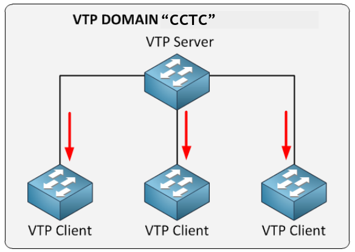

VLAN Trunking Protocol (VTP) is a Cisco proprietary protocol used to manage VLAN (Virtual Local Area Network) configurations across a network of switches. VTP simplifies VLAN management by allowing network administrators to make changes to VLAN configurations on one switch, and then automatically propagate these changes to all other switches in the same VTP domain. This ensures consistency and reduces the risk of configuration errors across multiple switches.

   - Key Concepts of VTP

       - 1. VTP Domain

           - Definition: A VTP domain is a group of switches that share the same VTP configuration and VLAN information. All switches in the same VTP domain share VLAN information and synchronize their VLAN databases.

           - Configuration: Each switch must be configured with the same VTP domain name to participate in the same VTP domain.

       - 2. VTP Modes

           - Server Mode:

              - Description: Switches in VTP Server mode can create, modify, and delete VLANs and share these VLAN configurations with other switches in the VTP domain. They also maintain a VLAN database that is synchronized with other switches.

               - Default Mode: Switches are in VTP Server mode by default.

           - Client Mode:

               - Description: Switches in VTP Client mode receive VLAN information from VTP Servers and apply these VLAN configurations, but they cannot create, modify, or delete VLANs. They rely on VTP Servers for their VLAN information.

           - Transparent Mode:

               - Description: Switches in VTP Transparent mode do not participate in VTP VLAN information exchange. They forward VTP advertisements but do not apply them or update their VLAN database based on VTP information. They maintain their own VLAN configurations and do not propagate changes to other switches.

           - Off Mode:

               - Description: In some contexts, "Off" mode may be used to disable VTP entirely on a switch. This mode is not a standard VTP mode but can be used to refer to a state where VTP is not active.

       - 3. VTP Advertisements

          - Types:

               - Summary Advertisements: Contain information about the VTP domain name, revision number, and VLAN information.

               - Subset Advertisements: Carry VLAN configuration changes.

               - Advertisement Requests: Request VTP advertisements from other switches.

           - Purpose: Advertisements are used to propagate VLAN changes and maintain consistency across the VTP domain.

       - 4. VTP Revision Number

           - Description: Each VTP advertisement includes a revision number that is incremented with each change to the VLAN configuration. Higher revision numbers indicate more recent configurations. Switches use the revision number to determine if they should update their VLAN database based on received advertisements.

There are three versions of VTP, version 1, version 2, version 3.

## Versions of Spanning Tree Protocol (STP)

   - Open Standards-Based Versions:

       - STP (802.1D):

           - Open standard defined by the IEEE 802.1D specification.

           - Basic version of the Spanning Tree Protocol, widely supported by networking equipment from various vendors.

           - Defines the original spanning tree algorithm for loop prevention in Ethernet networks.

           - Convergence Time: 30 to 50 seconds.

       - RSTP (802.1w):

           - Open standard defined by the IEEE 802.1w specification.

           - Improves upon the original STP by providing faster convergence and better performance.

           - Offers faster link failover times and better utilization of redundant links compared to STP.

           - Widely supported across networking equipment from multiple vendors.

           - Convergence Time: 6 seconds or less.

       - MSTP (802.1s):

           - Open standard defined by the IEEE 802.1s specification.

           - Extends RSTP to support multiple spanning tree instances, each of which can encompass multiple VLANs.

           - Helps reduce the number of spanning tree instances needed in large networks with multiple VLANs, improving scalability and manageability.

           - Convergence Time: Similar to RSTP (6 seconds or less).

   - Cisco Proprietary Versions:

       - Per-VLAN Spanning Tree (PVST) and PVST+ (Per-VLAN Spanning Tree Plus):

           - Proprietary spanning tree protocol developed by Cisco.

           - PVST and PVST+ extend the functionality of STP by creating a separate spanning tree instance for each VLAN.

           - Allows for finer control over spanning tree behavior on a per-VLAN basis, optimizing network performance and stability.

           - Convergence Time: Typically similar to STP (30 to 50 seconds).

       - Rapid Per-VLAN Spanning Tree (Rapid PVST):

           - Cisco’s proprietary version of RSTP, tailored for use with PVST+.

           - Offers faster convergence and better performance compared to traditional PVST+.

           - Provides rapid failover times for individual VLANs, enhancing network resilience and uptime.

           - Convergence Time: Typically similar to RSTP (6 seconds or less).

       - Cisco Multiple Spanning Tree Protocol (MSTP) Implementation:

           - Cisco offers its implementation of MSTP, which is compatible with the IEEE 802.1s standard.

           - Allows Cisco devices to participate in MSTP environments alongside equipment from other vendors.

           - Offers enhanced features and integration with other Cisco networking technologies.

           - Convergence Time: Typically similar to RSTP (6 seconds or less).

## Subnet Chart


## Headers

Packet Header breakdown:

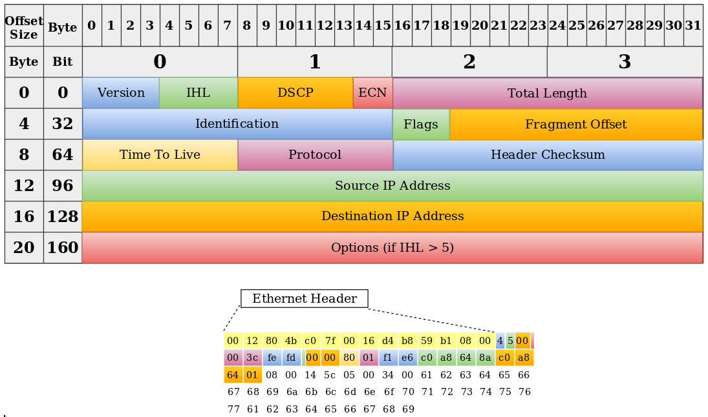

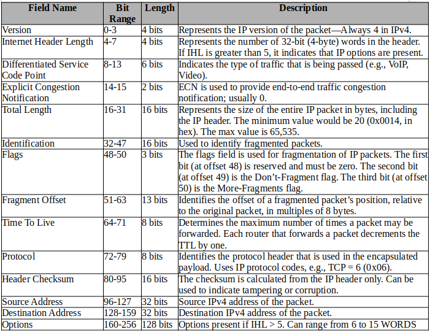

## VPN

### L2TP (TCP 1701)

   - Layer Two Tunneling Protocol (L2TP) serves as an extension of the Point-to-Point Tunneling Protocol (PPTP) commonly employed by internet service providers (ISPs) to establish virtual private networks (VPNs). The primary objective of L2TP is to enable secure data transmission through the creation of tunnels. To uphold security and privacy standards, L2TP necessitates the use of an encryption protocol within the established tunnel.

   - L2TP exhibits the capability to transport a diverse range of Layer 2 (L2) data types across an Internet Protocol (IP) or Layer Three (L3) network. The initiation of this process involves the establishment of a tunnel connecting an L2TP Access Concentrator (LAC) and an L2TP Network Server (LNS) on the internet. This configuration facilitates the implementation of a Point-to-Point Protocol (PPP) link layer, which is encapsulated and seamlessly transferred across the internet for secure and efficient communication.

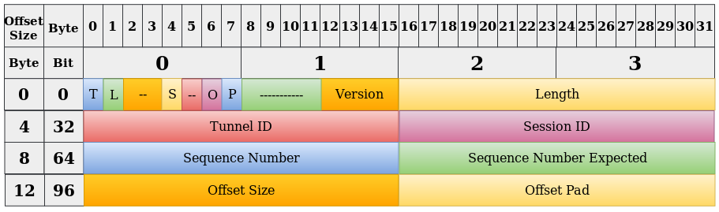

   - Specified in [RFC 2661](https://tools.ietf.org/html/rfc2661) Has origins from Cisco’s L2F and Microsoft’s PPTP. Does not provide any encryption itself. Relies on other encryption methods for confidentiality.

   - [L2TP Wiki Reference](https://en.wikipedia.org/wiki/Layer_2_Tunneling_Protocol)

   - [L2TP Example PCAP from Cloudshark](https://www.cloudshark.org/captures/42d07a525b55)

References:

- https://tools.ietf.org/html/rfc2661
- https://en.wikipedia.org/wiki/Layer_2_Tunneling_Protocol
- https://www.cloudshark.org/captures/42d07a525b55

### PPTP (TCP 1723)

   - Point-to-Point Tunneling Protocol (PPTP) stands as a foundational networking protocol that empowers the secure deployment of Virtual Private Networks (VPNs) over the Internet. Conceived by Microsoft and collaborative contributors, PPTP is intricately designed to forge a private and encrypted communication conduit between clients and servers, guaranteeing the secure transmission of data.

   - Authentication Mechanisms: PPTP boasts support for a range of robust authentication mechanisms, including Password Authentication Protocol (PAP), Challenge Handshake Authentication Protocol (CHAP), and Microsoft CHAP (MS-CHAP). These mechanisms play a pivotal role in fortifying the verification processes, ensuring the genuine identity of the connecting parties.

   - Encapsulation and Encryption Expertise: PPTP demonstrates its prowess by encapsulating data within its proprietary packets, establishing a secure tunnel for data transmission. Furthermore, it incorporates encryption protocols such as Microsoft Point-to-Point Encryption (MPPE) to safeguard the confidentiality of the transmitted data. This dual-layered approach enhances the privacy and integrity of the communication channel.

   - Awareness of Limitations: Recognizing its historical prevalence, it’s crucial to acknowledge the limitations associated with PPTP. While it was widely adopted in the past, PPTP has exhibited security vulnerabilities, prompting a gradual decline in usage. Organizations and users have increasingly favored more secure VPN protocols like L2TP/IPsec and OpenVPN to address evolving security standards and ensure a higher level of data protection.

[PPTP](../../0-src/pptp.png)

   - Specified in [RFC 2637](https://tools.ietf.org/html/rfc2637) Developed by Microsoft. Obsolete method to create VPN tunnels. Has many well know vulnerabilities.

   - [PPTP Wiki Reference](https://en.wikipedia.org/wiki/Point-to-Point_Tunneling_Protocol)

   - [PPTP Example PCAP from Cloudshark](https://www.cloudshark.org/captures/7a6644ad437e)


References:

- https://en.wikipedia.org/wiki/Virtual_private_network
- https://tools.ietf.org/html/rfc2637
- https://en.wikipedia.org/wiki/Point-to-Point_Tunneling_Protocol
- https://www.cloudshark.org/captures/7a6644ad437e

### IP Security (IPSec)

IPsec (Internet Protocol Security) is a suite of protocols used to secure IP communications by providing encryption, authentication, and integrity protection at the network layer (Layer 3) of the OSI model. It is widely used to establish Virtual Private Networks (VPNs) and secure data transmission over IP networks, including the internet.

Transport mode and Tunnel mode are two operational modes of IPsec (Internet Protocol Security) used to provide security for IP communications.

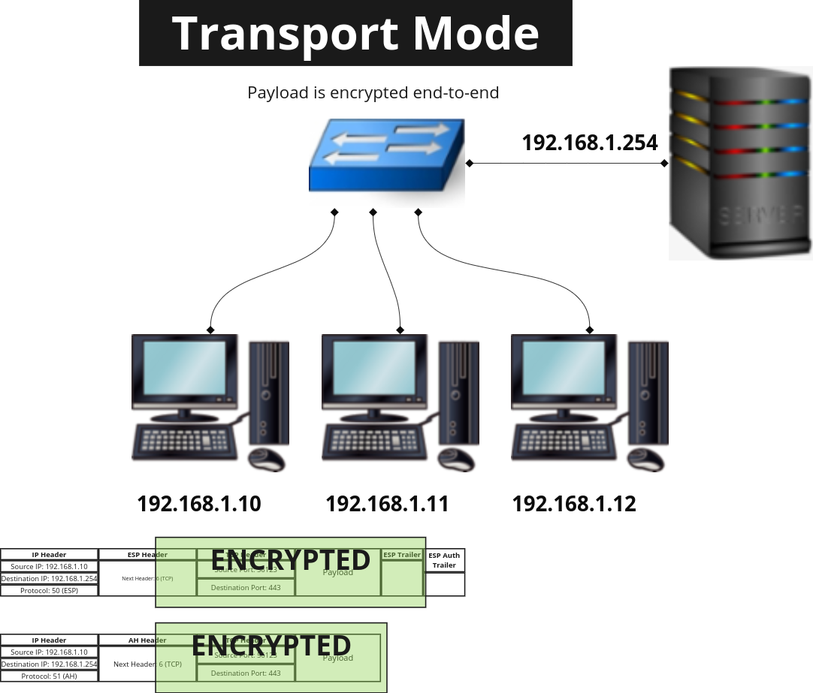

   - Transport Mode:

       - In Transport mode, IPsec only encrypts the payload (data) of the original IP packet, leaving the original IP header intact.

       - Transport mode is typically used for end-to-end communication between two hosts or devices.

       - When using Transport mode, only the data portion of the IP packet is protected by IPsec, while the original IP header, including the source and destination IP addresses, remains visible to intermediate devices.

       - Transport mode is often used for scenarios where the communicating endpoints need to establish a secure connection while maintaining direct communication with each other.

       - Example use cases for Transport mode include securing communication between individual hosts or devices within a private network or securing VoIP (Voice over IP) traffic between two endpoints.

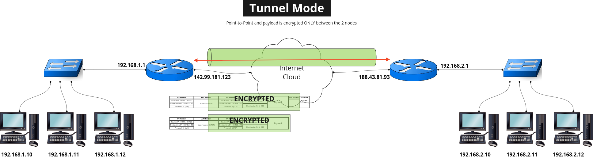

   - Tunnel Mode:

       - In Tunnel mode, IPsec encapsulates the entire original IP packet within a new IP packet, adding an additional IP header. Tunnel mode is commonly used to create secure VPN (Virtual Private Network) connections between networks or network devices, such as routers or firewalls.

       - When using Tunnel mode, the original IP packet, including its header and payload, is encrypted and encapsulated within a new IP packet.

       - The new IP header contains the IP addresses of the VPN gateway devices (tunnel endpoints), which are responsible for encrypting and decrypting the data as it passes through the VPN tunnel.

       - Tunnel mode provides network-level security, ensuring that all traffic between the VPN gateway devices is encrypted and protected from eavesdropping or tampering.

       - Example use cases for Tunnel mode include connecting branch offices to a central headquarters network over the internet, creating secure connections between remote users and a corporate network, or establishing site-to-site VPN connections between data centers.

   - Headers used by IPSec:

       - ESP Header (Encapsulating Security Payload):

           - Uses IP protocol number 50 to indicate IPSec with ESP Header payload.

           - The Encapsulating Security Payload provides confidentiality, integrity, and optional authentication for IP packets.

           - It encrypts the payload of IP packets to protect the confidentiality of the data being transmitted.

           - The ESP header includes fields for the Security Parameters Index (SPI), sequence number, padding, authentication data (MAC), and other parameters.

           - ESP can operate in either Transport mode (encrypts only the IP payload) or Tunnel mode (encrypts the entire IP packet).

           - Performs integrity check only on ESP header and payload. Not the outer IP header.

           - Does support protocols like NAT that alter the outer header.

           - Modification or changes to the outer header does not affect ESP.

       - AH Header (Authentication Header):

           - Uses IP protocol number 51 to indicate IPSec with AH Header payload.

           - The Authentication Header provides data integrity, authentication, and anti-replay protection for IP packets.

           - It is used to ensure that the data received has not been altered or tampered with during transmission.

           - The AH header includes fields for the Security Parameters Index (SPI), sequence number, authentication data (Message Authentication Code, MAC), and other parameters.

           - AH can operate in either Transport mode (protects only the IP payload) or Tunnel mode (protects the entire IP packet).

           - Performs integrity check on entire packet to include outer IP header.

           - Integrity done only on immutable fields: Version, Length, Next Header/protocol, Source address, Destination address

           - Mutable fields: DSCP/Traffic Class, Flow Label, TTL/Hop Limit

           - Does not support protocols like NAT that alter the outer header.

           - "mostly" obsolete

       - IKE Header (Internet Key Exchange):

           - IKE typically uses UDP port 500 for its main communication channel.

           - IKEv2 may use UDP port 4500 for NAT traversal (UDP encapsulation) to overcome NAT (Network Address Translation) issues.

           - IKE is used to establish Security Associations (SAs) and negotiate cryptographic parameters for IPsec.

           - It operates at the application layer (Layer 7) and is used to exchange keying material, negotiate encryption and authentication algorithms, and authenticate IPsec peers.

           - The IKE header includes fields for message type, exchange type, cryptographic algorithms, key exchange data, and other parameters.

           - IKE is typically used in conjunction with IPsec to establish secure VPN connections.

### OpenVPN

OpenVPN is an open-source VPN (Virtual Private Network) software that provides secure communication over the internet by creating encrypted tunnels between devices or networks. It is widely used for remote access VPNs, site-to-site VPNs, and other secure networking applications.

OpenVPN requires special software that implements the OpenVPN protocol. There are client and server versions. The client software runs on your device (computer, phone, etc.) and the server software runs on the VPN provider’s server. This software creates the encrypted tunnel and manages the data transmission.

It’s known for being very secure due to strong encryption algorithms and multiple authentication methods. OpenVPN uses the OpenSSL library to provide encryption of both the data and control channels.

It offers a high degree of customization, making it suitable for a wide range of uses. Because of the customization options, setting up OpenVPN can be more complex for non-technical users compared to some other VPN solutions.

   - OpenVPN can be configured to use UDP or TCP as it’s transport layer protocols:

       - UDP Protocol (Default):

           - OpenVPN often uses UDP for communication, providing a lightweight and connectionless transport protocol suitable for VPNs.

           - The default UDP port number for OpenVPN is 1194.

       - TCP Protocol:

           - OpenVPN can also be configured to use TCP for communication, which can be useful in scenarios where UDP traffic is restricted or blocked.

           - The default TCP port number for OpenVPN is 1194, but it can be configured to use other port numbers such as port 443.

# Sockets

## Describe Socket Types

   - Understanding socket types for network functions

       - User Space Sockets:

           - Stream socket - Normally used with TCP, SCTP, and Bluetooth. A stream socket provides a connection-oriented and sequenced flow of data which has methods for establishment and teardown of connections as well as error detection.

           - Datagram socket - Normally used with UDP. A datagram socket is connection-less by nature. Sockets built this way can send and receive data, but there is no mechanism to retransmit data if a packet is dropped.

           - Examples:

               - Using a User application such as a Web Browser, FTP, Telnet, SSH, netcat, etc to connect to any listening port.
                ```
                nc 10.0.0.1 22
                firefox http://10.0.0.1
                wget -r http://10.0.0.1
                curl ftp://10.0.0.1
                ftp 10.0.0.1
                telnet 10.0.0.1
                ssh user@10.0.0.1
                ```
               - Using tcpdump or wireshark to read a file
                ```
                tcpdump -r capture.pcap
                ```
               - Using nmap with no switches (-sS) or -sT
                ```
                nmap 10.0.0.1
                nmap -sT 10.0.0.1
                ```
               - Opening listening ports above the Well-Known range (1024+)
                ```
                python -m SimpleHTTPServer 7800
                nc -lvp 1234
                ```
               - Using /dev/tcp or /dev/udp to transmit data
                ```
                cat /etc/passwd > /dev/tcp/10.0.0.1/1234
                ```
       - Kernel Space Sockets:

           - Raw socket - A raw socket allows for the direct sending and receiving of IP packets without automatic protocol-specific transport layer formatting, meaning that all headers are typically included in the packet and not removed when moving up the network stack.

               - Raw sockets tend to be specially crafted packets that do not follow normal communication methods.

               - Any traffic that does not have a transport layer header (TCP/UDP) can be a RAW Socket.

                   - icmp - ping

                   - OSPF

                   - EIGRP

               - Packets that have to be crafted with various flag combinations and other header field manipulation must be created as RAW Sockets. Tools like HPING and Nmap needs to open raw sockets when attempting to set specific flags for performing certain scans.
                ```
                nmap -sX 10.0.0.1
                nmap -sN 10.0.0.1
                nmap -sF 10.0.0.1
                ```
               - Tcpdump requires raw sockets in order to receive each packet, in its entirety, for total packet analysis. The operating system normally strips all the headers when receiving data so to examine these packets with their headers intact they have to be captured as RAW Sockets.
                ```
                tcpdump -w capture.pcap
                ```
               - Using Scapy to craft or modify a packet for transmission

               - Using Python to craft or modify Raw Sockets for transmission

           - Opening well ports in the Well-Known range (0-1023) require kernel access.
            ```
            python -m SimpleHTTPServer 80
            nc -lvp 123
            ```

## TCPDUMP Primitive Qualifiers

TCPDUMP breaks down its filters into three (3) different capture qualifiers:

   - type - specifies the 'kind of thing' that the id name or number refers to.

       - Possible types are:

           - host

           - net

           - port

           - portrange

       - Examples: `host 192.168.1.1', `net 192.168.1.0/24', `port 22', `portrange 1-1023'. If there is no type qualifier, host is assumed.

   - dir - specifies a particular transfer direction to and/or from id.

       - Possible directions are:

           - src

           - dst

           - src or dst

           - src and dst

           - ra

           - ta

           - addr1, addr2, addr3, and addr4.

       - Examples: `src 192.168.1.1', `dst net 192.168.1.0/24', `src or dst port ftp-data'. If there is no dir qualifier, `src or dst' is assumed. The ra, ta, addr1, addr2, addr3, and addr4 qualifiers are only valid for IEEE 802.11 Wireless LAN link layers.

   - proto - restricts the match to a particular protocol(s).

       - Possible protos are: ether, fddi, tr, wlan, ip, ip6, icmp, icmp6, arp, rarp, decnet, tcp and udp.

       - Examples:

           - `ether src 192.168.1.1`

           - `arp net 192.168.1.0/24`

           - `tcp port 22`

           - `udp portrange 1-1023`

           - `wlan addr2 0:2:3:4:5:6`

       - If there is no proto qualifier, all protocols consistent with the type are assumed.

       - Examples: `src 192.168.1.1` means `(ip or arp or rarp) src 192.168.1.1`, `net 192.168.1.0/24` means `(ip or arp or rarp) net 192.168.1.0/24` and `port 53` means `(tcp or udp) port 53`.

## Basic TCPDump options

   - `-A` Prints the frame payload in ASCII.
```
tcpdump -A
```
   - `-D` Print the list of the network interfaces available on the system and on which TCPDump can capture packets. For each network interface, a number and an interface name, followed by a text description of the interface, is printed. This can be used to identify which interfaces are available for traffic capture.
```
tcpdump -D
```
   - `-i` Normally, eth0 will be selected by default if you do not specify an interface. However, if a different interface is needed, it must be specified.
```
tcpdump -i eth0
```
   - `-e` Prints Data-Link Headers. Default is to print the encapsulated protocol only.
```
tcpdump -e
```
   - `-X` displays packet data in HEX and ASCII.
   - `-XX` displays the packet data in HEX and ASCII to include the Ethernet portion.
```
tcpdump -i eth0 -X
tcpdump -i eth0 -XX
```
   - `-w` writes the capture to an output file
```
tcpdump -w something.pcap
```
   - `-r` reads from the pcap
```
tcpdump -r something.pcap
```
   - `-v` gives more verbose output with details on the time to live, IPID, total length, options, and flags. Additionally, it enables integrity checking.
```
tcpdump -vv
```
   - `-n` Does not covert protocol and addresses to names
```
tcpdump -n
```

Tcpdump for specific protocol traffic.
```
tcpdump port 80 -vn
```

The logical and relational operators can be combined with primitives to perform specific criteria for traffic filtering.

tcpdump for specific protocol traffic of more than one type.
```
tcpdump port 80 or 22 -vn
```
tcpdump for a range of ports on 2 different hosts with a destination to a specific network
```
tcpdump portrange 20-100 and host 10.1.0.2 or host 10.1.0.3 and dst net 10.2.0.0/24 -vn
```
tcpdump filter for source network 10.1.0.0/24 and destination network 10.3.0.0/24 or dst host 10.2.0.3 and not host 10.1.0.3.
```
tcpdump "(src net 10.1.0.0/24  && (dst net 10.3.0.0/24 || dst host 10.2.0.3) && (! dst host 10.1.0.3))"" -vn
```

## TCPDump Primitive Examples

Simple: Simple primitives are basic filters that match specific attributes of network packets. They are straightforward and generally used to focus on a particular aspect of the traffic. Examples include:

   - To print all ethernet traffic:

    `tcpdump ether`

   - To print all packets related to ARP:

    `tcpdump arp`

   - To print all packets related to ICMP:

    `tcpdump icmp`

   - To print all ICMP echo-request packets :

    `tcpdump 'icmp[icmptype] = icmp-echo'`

   - To print all ICMP echo-reply packets :

    `tcpdump 'icmp[icmptype] = icmp-reply'`

   - To print all packets arriving at or departing from 192.168.1.1:

    `tcpdump host 192.168.1.1`

   - To print all packets arriving at 192.168.1.1:

    `tcpdump dst host 192.168.1.1`

   - To print all packets departing from 192.168.1.1:

    `tcpdump src host 192.168.1.1`

   - To print all packets arriving at or departing from 192.168.1.0/24 network:

    `tcpdump net 192.168.1.0/24`

   - To print all packets departing from 192.168.1.0/24 network:

    `tcpdump src net 192.168.1.0/24`

   - To print all packets arriving at 192.168.1.0/24 network:

    `tcpdump dst net 192.168.1.0/24`

   - To print all packets related to IPv4:

    `tcpdump ip`

   - To print all packets related to IPv6:

    `tcpdump ip6`

   - To print all packets related to TCP:

    `tcpdump tcp`

   - To print all packets related to UDP:

    `tcpdump udp`

   - To print all packets arriving at or departing from TCP port 22:

    `tcpdump tcp port 22`

   - To print all packets arriving at TCP port 22:

    `tcpdump tcp dst port 22`

   - To print all packets departing from TCP port 22:

    `tcpdump tcp src port 22`

   - To print all packets arriving at or departing from TCP or UDP port 53:

    `tcpdump port 53`

   - To print all packets with TCP flag ACK set:

    `'tcp[tcpflags] = tcp-ack'`

Complex: Complex primitives combine multiple simple filters using logical operators or refine them to create more specific capture rules. They allow more granular control over the captured data. Examples include:

   - To print traffic between 192.168.1.1 and either 10.1.1.1 or 10.1.1.2:

    `tcpdump host 192.168.1.1 and ( 10.1.1.1 or 10.1.1.2 )`

   - To print all IP packets between 10.1.1.1 and any host except 10.1.1.2:

    `tcpdump ip host 10.1.1.1 and not 10.1.1.2`

   - To print all traffic between local hosts and hosts at Berkeley:

    `tcpdump net ucb-ether`

   - To print all ftp traffic through internet gateway 192.168.1.1: (note that the expression is quoted to prevent the shell from (mis-)interpreting the parentheses):

    `tcpdump 'gateway 192.168.1.1 and (port ftp or ftp-data)'`

   - To print traffic neither sourced from nor destined for local hosts (if you gateway to one other net, this stuff should never make it onto your local net).

    `tcpdump ip and not net localnet`

   - To print the start and end packets (the SYN and FIN packets) of each TCP conversation that involves a non-local host.

    `tcpdump 'tcp[tcpflags] & (tcp-syn|tcp-fin) != 0 and not src and dst net localnet'`

   - To print the TCP packets with flags RST and ACK both set. (i.e. select only the RST and ACK flags in the flags field, and if the result is "RST and ACK both set", match)

    `tcpdump 'tcp[tcpflags] & (tcp-rst|tcp-ack) == (tcp-rst|tcp-ack)'`

   - To print all IPv4 HTTP packets to and from port 80, i.e. print only packets that contain data, not, for example, SYN and FIN packets and ACK-only packets. (IPv6 is left as an exercise for the reader.)

    `tcpdump 'tcp port 80 and (((ip[2:2] - ((ip[0]&0xf)<<2)) - ((tcp[12]&0xf0)>>2)) != 0)'`

   - To print IP packets longer than 576 bytes sent through gateway 192.168.1.1:

    `tcpdump 'gateway 192.168.1.1 and ip[2:2] > 576'`

   - To print IP broadcast or multicast packets that were not sent via Ethernet broadcast or multicast:

    `tcpdump 'ether[0] & 1 = 0 and ip[16] >= 224'`

   - To print all ICMP packets that are not echo requests/replies (i.e., not ping packets):

    `tcpdump 'icmp[icmptype] != icmp-echo and icmp[icmptype] != icmp-echoreply'`

## Berkley Packet Filters

TCPDump filtering with BPF’s and bit-masking:
BPF’s in conjunction with TCPDump, operators, and bitmasking make for an extremely powerful traffic filtering and parsing tool.

   - The smallest filter that BPF can understand easily is a byte.

   - A span of bytes can be denoted as in the BPF Bytecode example `"ether[12:2]"`, starts at byte offset 12 and span 2 bytes in to look at the ethertype field.

   - Using BPFs with operators, bitmasking, and TCPDump creates a powerful tool for traffic filtering and parsing.

SYNTAX
```
tcpdump {A} [B:C] {D} {E} {F} {G}

A = Protocol ( ether | arp | ip | ip6 | icmp | tcp | udp )
B = Header Byte number
C = optional: Byte Length. Can be 1, 2 or 4 (default 1)
D = optional: Bitwise mask (&)
E = Relational operator ( = | == | > | < | <= | >= | != | () | << | >> )
F = Result of Expression
G = optional: Logical Operator (&& ||) to bridge expressions
```

Example:
`tcpdump 'ether[12:2] = 0x0800 && (tcp[2:2] != 22 && tcp[2:2] != 23)'`

This expression with look for any IPv4 traffic that is not SSH or Telnet.

   - First it will look at ether[12:2] which is typically the ethertype field. The expression tells the system to check if this field contains 0x0800.

   - Conjoins the first expression with the &&.

   - Using the () and || operators we can build two or more expressions to look for. In this case it checks the TCP destination field (tcp[2:2]) does not contain 22 or 23.

## BPFs at the Data-Link layer

   - Using BPFs to print source and destination MAC addresses. Since the maximum amount of bytes that can be read with BPF is 4 and the size of a MAC address is 6 bytes, we may have to prepare the filter in 2 or more parts conjoined.

       - Here are 2 ways we can search for the destination broadcast MAC address.
        ```
        tcpdump -i eth0 'ether[0:4] = 0xffffffff and ether[4:2] = 0xffff'
        tcpdump -i eth0 'ether[0:2] = 0xffff and ether[2:2]= 0xffff and ether[4:2] = 0xffff'
        ```
       - Here are 2 ways we can search for the source MAC address of fa:16:3e:f0:ca:fc.
        ```
        tcpdump -i eth0 'ether[6:4] = 0xfa163ef0 and ether[10:2] = 0xcafc'
        tcpdump -i eth0 'ether[6:2] = 0xfa16 and ether[8:2]= 0x3ef0 and ether[10:2] = 0xcafc'
        ```
   - Search the first byte of the source (ether[0]) and destination (ether[6]) MAC to determine if it’s a unicast (0x00) or multicast (0x01) MAC address.
```
tcpdump -i eth0 'ether[0] & 0x01 = 0x00'
tcpdump -i eth0 'ether[0] & 0x01 = 0x01'
tcpdump -i eth0 'ether[6] & 0x01 = 0x00'
tcpdump -i eth0 'ether[6] & 0x01 = 0x01'
```
   - Using BPFs to print packets interface with the EtherType (ether[12:2]) field matching IPv4, ARP, VLAN Tag, and IPv6 respectively.
```
tcpdump -i eth0 ether[12:2] = 0x0800
tcpdump -i eth0 ether[12:2] = 0x0806
tcpdump -i eth0 ether[12:2] = 0x8100
tcpdump -i eth0 ether[12:2] = 0x86dd
```
   - Print packets that belong to VLAN 100. Here we are masking out the 4-bit PCP/DEI field. It is unsure if this field will or will not have a value so it’s best to ignore these bits unless you are looking for a specific value here.
```
tcpdump -i eth0 'ether[12:2] = 0x8100 and ether[14:2] & 0x0fff = 0x0064'
tcpdump -i eth0 'ether[12:4] & 0xffff0fff = 0x81000064'
```
   - Print packets that have a double VLAN Tag.
```
tcpdump -i eth0 'ether[12:2] = 0x8100 and ether[16:2] = 0x8100'
```
   - Print packets that are potential Double tagging (VLAN Hopping) using VLAN 1 (native) to attack VLAN 999
```
tcpdump -i eth0 'ether[12:4] & 0xffff0fff = 0x81000001 && ether[16:4] & 0xffff0fff = 0x810003E7
```
   - Print all ARP requests and Reply’s respectively.
```
tcpdump -i eth0 arp[6:2] = 0x01
tcpdump -i eth0 arp[6:2] = 0x02
```

## BPFs at the Network layer

Print all ipv4 packets with the IHL greater than 5. This will indicate that there are IP options included after the IPv4 header but before the next encapsulated header.
```
tcpdump -i eth0 'ip[0] & 0x0f > 0x05'
tcpdump -i eth0 'ip[0] & 15 > 5'
```
Print ipv4 packets with the DSCP value of 16.
```
tcpdump -i eth0 'ip[1] & 0xfc = 0x40'
tcpdump -i eth0 'ip[1] & 252 = 64'
tcpdump -i eth0 'ip[1] >> 2 = 16'
```
Print ipv4 packets with ONLY the RES flag set. DF and MF must be off.
```
tcpdump -i eth0 'ip[6] & 0xE0 = 0x80'
tcpdump -i eth0 'ip[6] & 224 = 128'
```
Print ipv4 packets with ONLY the DF flag set. RES and MF must be off.
```
tcpdump -i eth0 'ip[6] & 0xE0 = 0x40'
tcpdump -i eth0 'ip[6] & 224 = 64'
```
Print ipv4 packets with ONLY the MF flag set. RES and DF must be off.
```
tcpdump -i eth0 'ip[6] & 0xE0 = 0x20'
tcpdump -i eth0 'ip[6] & 224 = 32'
```
Print ipv4 packets with any flag combination.
```
tcpdump -i eth0 'ip[6] & 0xE0 > 0'
tcpdump -i eth0 'ip[6] & 224 != 0'
```
Print ipv4 packets with the RES bit set. The other 2 flags are ignored so they can be on or off.
```
tcpdump -i eth0 'ip[6] & 0x80 = 0x80'
tcpdump -i eth0 'ip[6] & 128 = 128'
```
Print ipv4 packets with the DF bit set. The other 2 flags are ignored so they can be on or off.
```
tcpdump -i eth0 'ip[6] & 0x40 = 0x40'
tcpdump -i eth0 'ip[6] & 64 = 64'
```
Print ipv4 packets with the MF bit set. The other 2 flags are ignored so they can be on or off.
```
tcpdump -i eth0 'ip[6] & 0x20 = 0x20'
tcpdump -i eth0 'ip[6] & 32 = 32'
```
Print ipv4 packets with the offset field having any value greater than zero (0).
```
tcpdump -i eth0 'ip[6:2] & 0x1fff > 0'
tcpdump -i eth0 'ip[6:2] & 8191 > 0'
```
Print ipv4 packets with the TTL being equal to and less than 128.
```
tcpdump -i eth0 'ip[8] = 128'
tcpdump -i eth0 'ip[8] < 128'
```
Print any ICMPv4, TCP, or UDP encapsulated within an ipv4 packet.
```
tcpdump -i eth0 'ip[9] = 0x01'
tcpdump -i eth0 'ip[9] = 0x06'
tcpdump -i eth0 'ip[9] = 0x11'
```
Print ipv4 packets with the source and destination address of 10.1.1.1.
```
tcpdump -i eth0 'ip[12:4] = 0x0a010101'
tcpdump -i eth0 'ip[16:4] = 0x0a010101'
```
Print ipv6 packets with the Traffic Class of any value.
```
tcpdump -i eth0 'ip6[0:2] & 0x0ff0 != 0'
```
Print ipv6 packets with the Flow Label field of any value.
```
tcpdump -i eth0 'ip6[0:4] & 0x000FFFFF != 0'
```
Print any ICMPv6, TCP, or UDP encapsulated within an ipv6 packet.
```
tcpdump -i eth0 'ip6[6] = 0x3a'
tcpdump -i eth0 'ip6[6] = 0x06'
tcpdump -i eth0 'ip6[6] = 0x11'
```
Print ipv6 packets with the TTL being equal to and less than 128.
```
tcpdump -i eth0 'ip6[7] = 128'
tcpdump -i eth0 'ip6[7] < 128'
```
Print ICMPv4 packets set to Destination Unreachable (Type 3) and Network Administratively Prohibited (Code 9). Note: ICMPv6 is not supported by BPFs.
```
tcpdump -i eth0 'icmp[0] = 3 and icmp[1] = 9'
```

6.2.6.1.1 Wireshark Display Filters

Wireshark display filters are a powerful feature that allows users to selectively view network traffic based on specific criteria. These filters enable users to focus on particular packets of interest while disregarding others, making it easier to analyze network communication and identify relevant information.

Here is a list of common and popular Wireshark Display filters.

    Filtering for a particular protocol will give all packets that have the protocol header in the packet payload.

        This will NOT show the TCP setup, TCP teardown, or fragmented packets that are part of the communication but do not have the protocol header in payload.

        We can filter for specific protocols such as:

            Layer 2: eth, arp, vlan, wlan

            Layer 3: ip, ipv6, icmp, icmpv6

            Layer 4: tcp, udp

            Layer 5: smb, socks, rpc

            Layer 7: telnet, ssh, http, ssl, tls, quic, dns, ftp, ftp-data, tftp, smtp, pop, imap, dhcp or bootp, ntp, tacplus, radius, rdp

            Routing protocols: rip, ospf, bgp

    We can filter for specific addresses:

        Layer 2: eth.addr, eth.dst ==, eth.src ==

        Layer 3: ip.addr ==, ip.dst ==, ip.src ==

        Layer 4: tcp.port ==, tcp.dstport ==, tcp.srcport ==, udp.port ==, udp.dstport ==, udp.srcport ==

    IPv4 Filters:

        IHL: ip.hdr_len == 20, ip.hdr_len > 20

        DSCP: ip.dsfield.dscp > 0, ip.dsfield.dscp == 48

        ECN: ip.dsfield.ecn > 0. ip.dsfield.ecn == 2

        Flags: ip.flags.rb == 1, ip.flags.df == 1

        Fragmentation: (ip.flags.mf == 1) || (ip.frag_offset > 0)

        TTL: ip.ttl == 64, ip.ttl == 128, ip.ttl ⇐ 64 && ip.ttl > 30 && !(ip.ttl > 64)

        Protocol: ip.proto == 1, ip.proto == 6, ip.proto == 17

        6-in-4 or 6-to-4 encapsulation: ip.proto == 41

    IPv6 Filters:

        Traffic Class: ipv6.tclass > 0, ipv6.tclass == 0xe0

        Next Header: ipv6.nxt == 6, ipv6.nxt == 17, ipv6.nxt == 58

        4-in-6 encapsulation: ipv6.nxt == 4

    TCP Specific Filters:

        TCP Offset: tcp.hdr_len == 32, tcp.hdr_len > 20

        TCP Flags:

            Individual Flags: tcp.flags.syn == 1, tcp.flags.ack == 0, tcp.flags.urg == 1. tcp.flags.reset == 1

            Flag Combinations: tcp.flags == 0x002, tcp.flags == 0x012, tcp.flags == 0x010, tcp.flags == 0x018

        Urgent Pointer: tcp.urgent_pointer > 0

    HTTP specific filters:

        http.request

        http.request.method == <method>

            <method> = GET, POST, HEAD, etc.

        http.response

        http.response.code == <code>

            100, 200, 300, 400, etc.

        http.user_agent, http.user_agent == "Mozilla/5.0 (Windows; U; Windows NT 5.1; en-US; rv:1.8.1.2) Gecko/20070219 Firefox/2.0.0.2", !(http.user_agent == "Mozilla/5.0 (Windows; U; Windows NT 5.1; en-US; rv:1.8.1.2) Gecko/20070219 Firefox/2.0.0.2")

    DNS filters:

        Query: A = dns.qry.type == 1, NS = dns.qry.type == 2, SOA = dns.qry.type == 6, AAAA = dns.qry.type == 28, AXFR = dns.qry.type == 252

        Response: A = dns.resp.type == 1, NS = dns.resp.type == 2, SOA = dns.resp.type == 6, AAAA = dns.resp.type == 28, AXFR = dns.resp.type == 252

    SSH Filters:

        ssh.protocol, ssh.protocol == "SSH-2.0-OpenSSH_7.2p2 Ubuntu-4ubuntu2.1"

    ARP Filters:

        ARP Request/Reply: arp.opcode == 1, arp.opcode == 2

        RARP Request/Reply: arp.opcode == 3, arp.opcode == 4

        Gratutious ARP: (arp.opcode == 2) && (eth.addr == ff:ff:ff:ff:ff:ff)

    ICMP Filters:

        Echo Request: icmp.type == 0

        Echo Reply: icmp.type == 8

        Time Exceeded: icmp.type == 11

        Destination Unreachable and Port Unreachable: (icmp.type == 3) && (icmp.code == 3)

    DHCP Filters:

        Client to Server: (udp.srcport == 68) && (udp.dstport == 67)

        Server to Client: (udp.srcport == 67) && (udp.dstport == 68)

        Discover: dhcp.option.dhcp == 1

        Offer: dhcp.option.dhcp == 2

        Request: dhcp.option.dhcp == 3

        Ack: dhcp.option.dhcp == 5

    FTP Filters:

        Commands: ftp.request.command

        Sending username or password: ftp.request.command == "USER", ftp.request.command == "PASS"

        Download file: `ftp.request.command == "RETR"

        Upload file: ftp.request.command == "STOR"

        Switch to passive mode: ftp.request.command == "PASV"

        Directory listing: ftp.request.command == "LIST"

