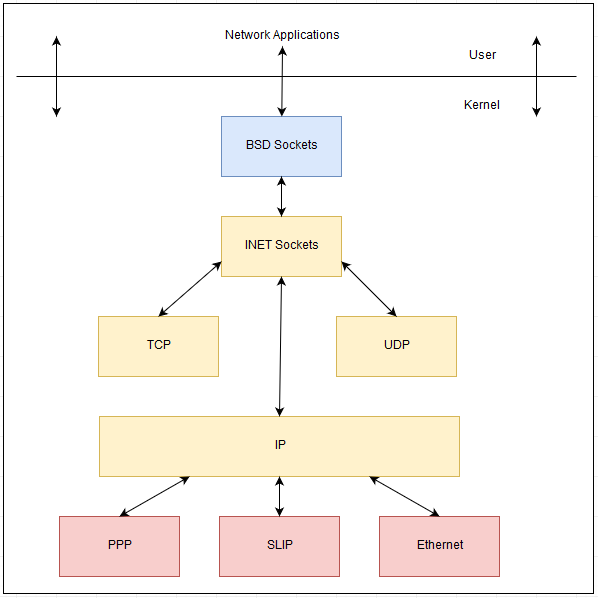

# Socket Programming

## Differentiate user space/kernel space sockets



   - System memory can be divided into two regions: kernel space and user space. Kernel space is where the operating system runs and provides its services. User space is a portion of system memory where a user’s processes can run. For a user space process to access or execute functions that require interaction with the OS software or the host’s hardware, a system call to the kernel is made on behalf of the user space process. This segregation of privilege is important to maintaining system stability and security. OSes generally use a number of API’s and libraries in order to manage the functions that span user to kernel space.

   - Sockets can be created by programs that reside in user space, however, in order to function with/through the device hardware, a corresponding kernel socket must be created and linked. If a program is seeking access to or through a device (hardware) such as a NIC, privileges are needed in order to access or link to kernel space sockets.

   - Stream and Datagram sockets are considered user space sockets and are typically the most common. These sockets do not need elevated privileges to perform the actions the user level applications are attempting.

    - Raw sockets are considered kernel space sockets since they are attempting to access hardware interfaces directly to prevent encapsulation/decapsulation or to create packets from scratch.

### User space Applications and Sockets

    - Using tcpdump or wireshark to read a file

    - Using nmap with no switches

    - Using netcat to connect to a listener

    - Using netcat to create a listener above the well known port range (1024+)

    - Using /dev/tcp or /dev/udp to transmit data

### Kernel space Applications and Sockets

    - Using tcpdump or wireshark to capture packets on the wire

    - Using nmap for OS identification or to set specific flags when scanning

    - Using netcat to create a listener in the well known port range (0 - 1023)

    - Using Scapy to craft or modify a packet for transmission

### Understanding Python Libraries

   - Libraries - The Python standard library is only one of many libraries created for Python programming. There are "third-party" created libraries available for public use. Each of these libraries contains its own modules and functions. To get an idea of some other libraries you can reference this link of [20 Python libraries you can’t live without](https://yasoob.me/2013/07/30/20-python-libraries-you-cant-live-without/).

   - Additional 3rd party libraries can be found at https://pypi.org/.

   - Python comes pre-loaded with its own standard library that can be referenced here ( https://docs.python.org/3/library/ ).

       - The Python library can contain:

           - [Modules](https://docs.python.org/3/library/index.html) - is a file consisting of Python code. A module can define functions, classes and variables. Some popular modules are:

               - [struct](https://docs.python.org/3/library/struct.html)

               - [socket](https://docs.python.org/3/library/socket.html)

               - [sys](https://docs.python.org/3/library/sys.html)

           - Function - A function is a block of organized, reusable code that is used to perform a single, related action. Functions provide better modularity for your application and a high degree of code reusing. A function is a block of code within a module which only runs when it is called. You can pass data, known as parameters, into a function. A function can return data as a result. Functions are defined using the def keyword. Some popular functions include:

               - struct.pack

               - socket.socket

               - or other "user-defined"

               - [Built-In Examples](https://docs.python.org/3/library/functions.html):

                   - `int()`

                   - `len()`

                   - `str()`

                   - `sum()`

                   -` print()`

          - Methods - is a piece of code or function that “belongs to” an object. It is a function that belongs to an object (such as a string, list, or custom class). Methods are called on objects and often work with the data inside the object.

               - [What is a Method](https://docs.python.org/3/library/stdtypes.html#methods)

               - The method is implicitly used for an object for which it is called by using the ..

               - The method is accessible to data that is contained within the function/class.

               - Can create methods within the function or can call a 'built-in' method

               - does not normally return data

               - cannot be called to perform a task without calling the Class/Object it’s associated with.

               - can be simple such as changing the case or printing test.

               - You can have methods to perform mathematical tasks like add, sub, multiply, or divide.

               - [Built-In String Method Examples](https://docs.python.org/3/library/stdtypes.html#string-methods):

                   - `my_string.upper()`

                   - `my_string.lower()`

                   - `my_list.strip()`

                   - `my_string.split()`

                   - `my_list.replace()`

                   - `my_list.count()`

                   - `my_list.clear()`

                   - `my_list.append()`

                   - `my_list.insert()`

   - [Exceptions](https://docs.python.org/3/library/exceptions.html) - An exception is a special condition encountered during program execution that is unexpected or anomalous. This will typically break your code with some sort of error. Typically you hear exception handling to manage issues such as:

       - Attempting to execute without proper permissions

       - Using Ctrl + C to perform a non-graceful exit of the program

       - Attempting to access a file that does not exist

   - [Constants](https://docs.python.org/3/library/constants.html) - A constant is a term used to describe data or a value that does not change in a specified amount of time, unlike a variable. Some examples include:

       - `AF_INET` - always represents ipv4 address family

       - `AF_INET6` - always represents ipv6 address family

       - `SOCK_STREAM` - always represents a stream socket

       - `SOCK_DGRAM` - always represents a datagram socket

       - `SOCK_RAW` - always represents a raw socket

   - Objects - a section of code used in object-oriented programming that can be used by other object modules or the program being created. Some objects in the socket function are:

       - `socket.bind(address)`

       - `socket.connect(address)`

       - `socket.send(bytes[,flags])`

       - `socket.close()`

   - Python Collections (Arrays) - There are four collection data types in the Python programming language:

       - [List](https://docs.python.org/3/library/stdtypes.html#lists) data structure in Python that is a mutable, or changeable, ordered sequence of elements. Each element or value that is inside of a list is called an item. Just as strings are defined as characters between quotes, lists are defined by having values between square brackets [ ] . thislist = ["apple", "banana", "cherry"] print(thislist) print(thislist[1]) print(thislist[-1])

       - [Tuple](https://docs.python.org/3/library/stdtypes.html#tuples) immutable sequence of Python objects. Tuples are sequences, just like lists. The differences between tuples and lists are, the tuples cannot be changed unlike lists and tuples use parentheses, whereas lists use square brackets. Creating a tuple is as simple as putting different comma-separated values and having the values between ( ).
        ```
        thistuple = ("apple", "banana", "cherry")
        print(thistuple)
        ```
       - Set is a collection which is unordered and unindexed. No duplicate members.
        ```
        thisset = {"apple", "banana", "cherry"}
        print(thisset)
        ```

### Using python3 to create sockets

In order to program sockets with python3, you need to understand some of the libraries and functions that go along with it. The first library we will discuss is the socket module.

   - Inside the socket module we will first look at the functions that are tied to the socket function - "socket.socket". Here is an example:
```
import socket
s = socket.socket(socket.FAMILY, socket.TYPE, socket.PROTOCOL)
```
   - Here we import the socket module which provides access to the functions in the socket module.

   - Then we create a variable s to link to the socket function in the socket library.

   - Inside the socket.socket function, you have these arguments in order: socket.socket([family[,type[,proto]]]).

       - Possible values for the socket objects:

           - family constants should be: `AF_INET` (default), `AF_INET6`, `AF_UNIX`

           - type constants should be: `SOCK_STREAM` (default), `SOCK_DGRAM`, `SOCK_RAW`

           - proto constants should be: `0` (default), `IPPROTO_TCP`, `IPPROTO_UDP`, `IPPROTO_ICMP`, `IPPROTO_RAW`

### Understanding Socket API Functions

Before we start to create our own sockets lets take a moment to understand the componnents and the order that a socket is established.

   - Components. Many are required for every TCP/UDP connection. Some are optional.

       - [socket()](https://docs.python.org/3/library/socket.html#socket.socket) creates a new socket of a certain type, identified by an integer number, and allocates system resources to it.

       - [setsockopt()](https://docs.python.org/3/library/socket.html#socket.socket.setsockopt) used to configure various options for a socket connection. This method allows you to modify the behavior of a socket by setting socket-level options.

       - [bind()](https://docs.python.org/3/library/socket.html#socket.socket.bind) is typically used on the server-side, and associates a socket with a socket address structure, i.e. a specified local IP address and a port number.

       - [listen()](https://docs.python.org/3/library/socket.html#socket.socket.listen) is used on the server-side, and causes a bound TCP socket to enter listening state.

       - [connect()](https://docs.python.org/3/library/socket.html#socket.socket.connect) is used on the client-side, and assigns a free local port number to a socket. In the case of a TCP socket, it causes an attempt to establish a new TCP connection.

       - [accept()](https://docs.python.org/3/library/socket.html#socket.socket.accept) is used on the server-side. It accepts a received incoming attempt to create a new TCP connection from the remote client, and creates a new socket associated with the socket address pair of this connection.

       - [send()](https://docs.python.org/3/library/socket.html#socket.socket.send), [sendall()](https://docs.python.org/3/library/socket.html#socket.socket.sendall), [recv()](https://docs.python.org/3/library/socket.html#socket.socket.recv), [sendto()](https://docs.python.org/3/library/socket.html#socket.socket.sendto), and [recvfrom()](https://docs.python.org/3/library/socket.html#socket.socket.recvfrom) are used for sending and receiving data. The standard functions write() and read() may also be used.

       - [close()](https://docs.python.org/3/library/socket.html#socket.close) causes the system to release resources allocated to a socket. In case of TCP, the connection is terminated.

       - [gethostbyname()](https://docs.python.org/3/library/socket.html#socket.gethostname) and [gethostbyaddr()](https://docs.python.org/3/library/socket.html#socket.gethostbyaddr) are used to resolve hostnames and addresses. IPv4 only.

       - [select()](https://docs.python.org/3/library/select.html#select.select) is used to suspend, waiting for one or more of a provided list of sockets to be ready to read, ready to write, or that have errors.

       - [poll()](https://docs.python.org/3/library/select.html#select.poll) is used to check on the state of a socket in a set of sockets. The set can be tested to see if any socket can be written to, read from or if an error occurred.

       - [getsockopt()](https://docs.python.org/3/library/socket.html#socket.socket.getsockopt) is used to retrieve the current value of a particular socket option for the specified socket.

       - [setsockopt()](https://docs.python.org/3/library/socket.html#socket.socket.setsockopt) is used to set a particular socket option for the specified socket.

- Typical TCP Connection


### TCP Stream Client

Here is an example of creating an IPv4 Stream socket. Note that proto field is unnecessary since it keeps the default value of zero.
```
import socket

# This can also be accomplished by using s = socket.socket() due to AF_INET and SOCK_STREAM being defaults
s = socket.socket(socket.AF_INET, socket.SOCK_STREAM)

ipaddr = '127.0.0.1'
port = 1111

s.connect((ipaddr, port))

# To send a string as a bytes-like object, add the prefix b to the string. \n is used to go to the next line (hit enter)
s.send(b'Message\n')

# It is recommended that the buffersize used with recvfrom is a power of 2 and not a very large number of bits
data, conn = s.recvfrom(1024)

# In order to receive a message that is sent as a bytes-like-object you must decode into utf-8 (default)
print(data.decode('utf-8'))

s.close()
```
   - In the above, we are creating a socket with address family = AF_INET (IPv4) and type = SOCK_STREAM (TCP).

   - We then define an ip address and port pair.

   - Next we call the socket object connect(address) tied to IPv4 and TCP we mapped to the variable s which will connect to the remote address and port we provide over IPv4 and TCP.

   - Continuing on, we will add to this connection by attempting to send a message through the connection and wait for a response.

   - When we call the socket object send(data) which is also tied to s, it sends whatever we put in for data across the connection. By typing b’Message\n', the string 'Message\n' is converted to a bytes-like object (b) which is required before sending.

   - After sending the message, we will attempt to receive data from the socket by using the socket object recvfrom(buffersize) tied to the variable s. The socket object recvfrom receives data in a pair (bytes, address) where bytes is the data received as a bytes-like object and address is the socket address. We split recvfrom into the two variables response and conn so we can print only the data portion.

   - Next we want to print the data received, but we need to decode response into utf-8 (default) from the bytes-like object or it will maintain the prefix b from the message sent across.

   - Lastly, we will close the socket tied to the variable s to clean up when we are finished.

   - To test, simply echo a message into a netcat listener session on the same machine you run this script on.
    ```
    echo "I got your message" | nc -l -p 54321
    ```
   - Then run the script on another terminal.
    ```
    python3 fg_stream_socket_example_p3.py
    ```
   - The result will be the message "Hello" is sent to the listener and the message "I got your message" is sent to the terminal that ran the script.

   - You can change the ipaddr variable to 10.3.0.2 and port to 1234 to get an automated response. If you do this, watch the connection with tcpdump -X or wireshark to see exactly what is sent across the wire and what is received.

### TCP Stream Server (OPTIONAL)
```
#!/usr/bin/python3
import socket
import os
port = 1111
message = b"Connected to TCP Server on port %i\n" % port

# Create TCP stream socket using IPv4

s = socket.socket(socket.AF_INET, socket.SOCK_STREAM, 0)

# This prevents the bind from being stuck in TIME_WAIT state. The SO_REUSEADDR flag tells the kernel to reuse a local socket in TIME_WAIT state, without waiting for its natural timeout to expire. Will not work if the socket is to the same destination.

s.setsockopt(socket.SOL_SOCKET, socket.SO_REUSEADDR, 1)

# Bind the socket to address.  The socket must not already be bound.
# '' Ties the socket to any IPv4 address on this device

s.bind(('', port))

# Enable a server to accept connections. Listens for 1 request to connect

s.listen(1)

# Execute the command (a string) in a subshell.

os.system("clear")

print ("Waiting for TCP connections\n")

#Listens for connections until stopped
while 1:
    conn, addr = s.accept()
    # This accepts connections from clients and creates a new socket.
    # The return value is a pair (conn, address)
    # conn = a new socket object usable to send and receive data on the connection (local)
    # address = the address bound to the socket on the other end of the connection (remote)

    connect = conn.recv(1024)
    # Waits for a message to be sent across and breaks out the address
    # Receive data from the socket.
    # The return value is a bytes object representing the data received.
    # The maximum amount of data to be received at once is specified by buffsize

    # connect = data recieved from remote to your local socket.

    address, port = addr
    # splits addr into 2 variables that is contained within it. Remote IP and remote port.
    # Prints the message

    print ("Message Received - '%s'" % connect.decode())  # Attempts to decode the message sent into utf-8 by default

    print ("Sent by -", address, "port -", port, "\n")   # Extracts the address and port that sent the message

    # Sends our message in response. Used when there is a remote connection (TCP)
    conn.sendall(message)

    # Closes the local connection from remote
    conn.close()
```

### UDP Dgram Client

Now that we have built a stream socket, we will build a datagram socket to closely mirror the stream socket. Here is an example:
```
import socket

s = socket.socket(socket.AF_INET, socket.SOCK_DGRAM)

ipaddr = '127.0.0.1'
port = 2222

# To send a string as a bytes-like object, add the prefix b to the string. \n is used to go to the next line (hit enter)
s.sendto(b'Message\n', (ipaddr,port))

# It is recommended that the buffersize used with recvfrom is a power of 2 and not a very large number of bits
response, conn = s.recvfrom(1024)

# In order to receive a message that is sent as a bytes-like-object you must decode into utf-8 (default)
print(response.decode())
```
   - Notice one of the changes here is that we had to use socket.SOCK_DGRAM instead to indicate that the protocol is UDP instead of TCP.

   - Additionally we removed the connect() and used sendto() rather than send() since we do not connect with UDP. With sendto we need to provide the socket tuple (address, port) with it.

   - To test, simply echo a message into a netcat listener session on the same machine you run this script on but with the -u option to indicate UDP.
    ```
    echo "I got your message" | nc -l -p 2222 -u
    ```
   - Then run the script on another terminal.
    ```
    python3 fg_dgram_socket_example_p3.py
    ```
   - The result will be the message "Hello" is sent to the listener and the message "I got your message" is sent to the terminal that ran the script.

### HEX Encoding/Decoding

   - `xxd`: creates a hex dump of a given file or standard input. It can also convert a hex dump back to its original binary form.

       - `xxd` - https://linux.die.net/man/1/xxd, https://www.howtoforge.com/linux-xxd-command/, https://www.tutorialspoint.com/unix_commands/xxd.htm
        ```
        Encode text to Hex
            echo "Message" | xxd
        ```
        ```
        Encode file to Hex
            xxd {options} infile (outfile)
            xxd file.txt file-encoded.txt
        ```
        ```
        Reverts Hex file to ASCII
            xxd -r file-encoded.txt file-decoded.txt
        ```

   - HEX encoding using Python
    ```
    import binascii
    ```
    ```
    message = b'Message'
    hidden_msg = binascii.hexlify(message)
    ```
    HEX decoding using Python
    ```
    new_msg = binascii.unhexlify(hidden_msg)
    ```

### BASE64 Encoding/Decoding

   - base64: tool can encode and decode file or input to/from base64 character encoding.

       - base64 - https://linux.die.net/man/1/base64
        ```
        Displays text in base64
            echo "convert me" | base64
            Y29udmVydCBtZQo=
        ```
        ```
        Displays the base64 in ASCII
            echo "Y29udmVydCBtZQo=" | base64 --decode
            convert me
        ```
        ```
        Converts content to base64 then save to file
            base64 file.txt > file-encoded.txt
        ```
        ```
        Converts content from base64 back to origional format
            base64 -d file-encoded.txt > file-decoded.txt
        ```

   - BASE64 encoding using Python
    ```
    import base64
    ```
    ```
    message = b'Message'
    hidden_msg = base64.b64encode(message)
    ```
    BASE64 decoding using Python
    ```
    new_msg = base64.b64decode(hidden_msg)
    ```

