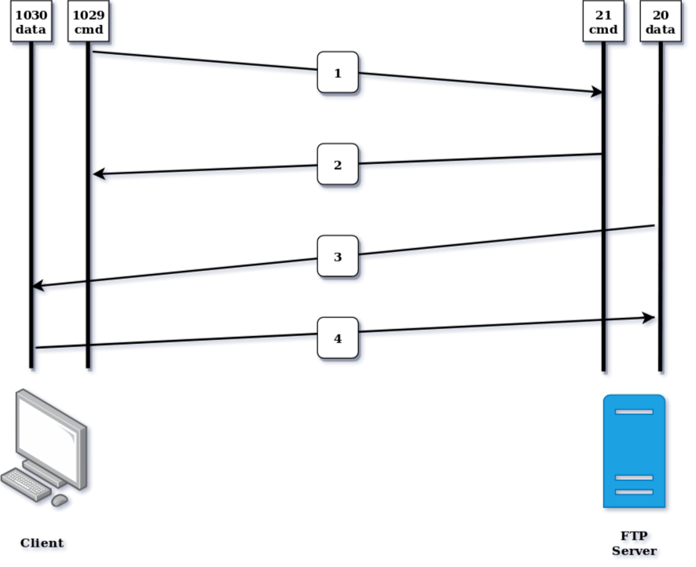
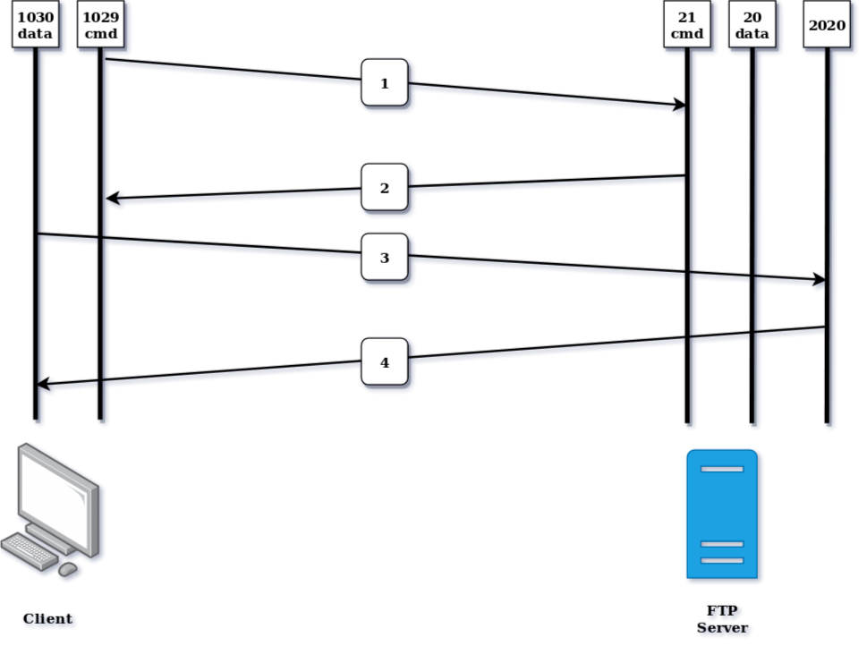
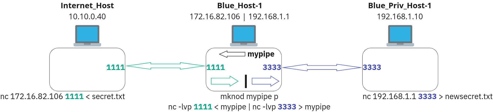
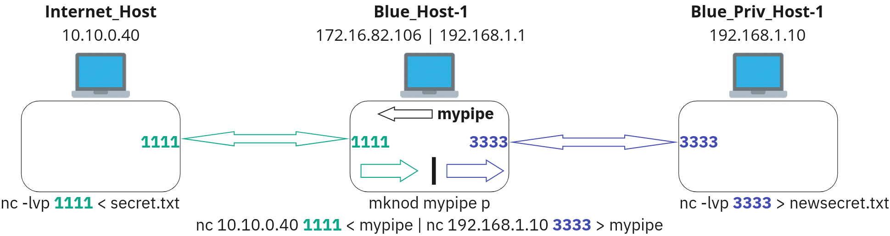
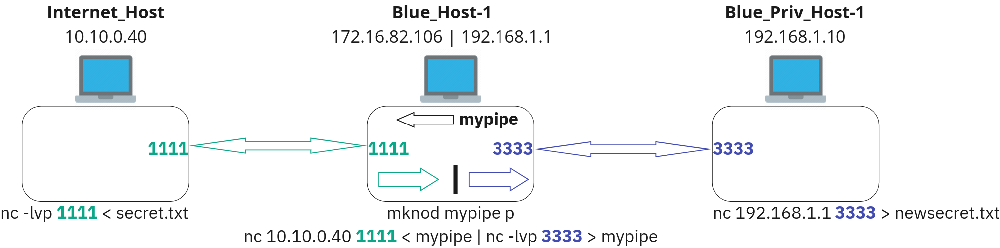
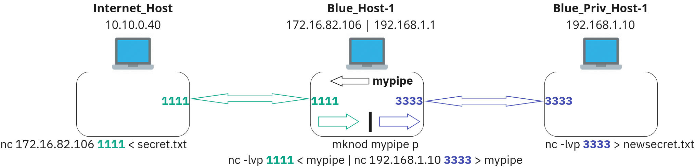

# File Transfer and Redirect

## TFTP

Trivial File Transfer Protocol is a simple protocol for file transfer. It's extremely small, unsecure, and very simple communication. Developed in the 1970s and commonly used to transfer files between network devices; especially those that lack sufficient memory or disk space. This protocol is still used today in some consumer and commercial routers.

   - published in RFC 1350 Rev2
   - uses UDP port 69
   - Unsecure - no authentication or encryption
   - no terminal communication or directory services
   - useful for booting disk-less nodes in LAN's supporting technologies such as BOOTP for example. (BOOTP assigns the client IP address and tells where to find the TFP server, TFTP serves up the boot image to the client)

## FTP

File Transfer Protocol is a standard network protocol that is used for file transfer using the client-server architecture model.

   - originally published in RFC 114 in 1971, it was last revised in 1985 with the publication of RFC 959
   - uses TCP port 21 for control and port 20 for data connections
   - unsecure - passes authentication (username and password) and all communication in clear text
   - can be configured for Anonymous login
   - has directory services and terminal communication
   - FTP has two modes of operation:
       - Active
       - Passive

|User Command |	System Command |	Action|
|---|---|---|
|ls |	LIST |	Lists the contents of the current directory on the remote FTP server.|
|pwd |	PWD |	Prints the current working directory on the remote FTP server.|
|cd |	CWD |	Changes the current working directory on the remote FTP server.|
|get |	RETR |	Retrieves a file from the remote FTP server and stores it locally.|
|put |	STOR |	Stores a file on the remote FTP server.|
|passive |	PASV |	Switches the FTP server into passive mode for data transfer.|
|quit/exit |	QUIT |	Terminate FTP sessions and exit.|
|delete |	DELE |	Deletes a file on the remote FTP server.|
|mkdir | MKD |	Creates a new directory on the remote FTP server.|

### Active FTP

In active FTP, the FTP client initiates the control but the server initiates the data connections. After establishing the control connection (typically on port 21), the client sends a PORT command over the control connection to the server, specifying which port it will listen on for incoming data connections. The server then initiates a data connection to the client's specified port to transfer files.

A client initiates a connection with a server on port 21 from the client's ephemeral high port. The three way handshake is completed and the client listens on its ephemeral high port + 1, the client sends the port N+1 command to the server on port 21 (control port). Ex: if the command to the server is from ephemeral port 1026, it would listen on port 1027. Once that is done, the server initiates a connection to the client's ephemeral high (1027) from the server's data port (20) and the data is transferred.

Its important to note that for Active FTP to work, both client and server must be able to connect to each other. Any firewalls or NAT can interfear will communication.

   - ftp active pcap



**Active FTP Diagram Walkthrough**

   - The client's command port contacts the server's command port and sends a command for the client's ephemeral high port + 1
   - The FTP server responds to the client with an ACK to the client's command port
   - The FTP server initiates initiates a connection from its data port 21 to the client's specified data port (ephemeral high + 1)
   - The FTP client sends an ACK back to the server's data port 20 from the client's ephemeral high data port. This also leads to issues when using ftp through an SSH tunnel which will be discussed later.

**Problem posed by Active FTP:**

   - Active FTP can encounter issues with firewalls and NAT (Network Address Translation) devices because the server initiates the data connection back to the client. Firewalls may block incoming connections, causing problems with data transfer.

   - In active FTP, the client must have a range of ports available for incoming data connections. The client's firewall must also allow traffic on these ports.

   - Using ftp to connect to a remote host
       - From bob-host we use ftp 10.0.0.104 to connect to james-host by it's ip 10.0.0.104.
       - We authenticate with either anonymous, james, or any other account on the system.
           - Using anonymous we will be able to see the contents of the ftp-root folder.
           - Using james we will be able to see any files in james's home drive.

```
bob@bob-host:~$ ftp 10.0.0.104
Connected to 10.0.0.104.
220 ProFTPD Server (Debian) [::ffff:10.0.0.104]
Name (10.0.0.104:bob): anonymous
331 Anonymous login ok, send your complete email address as your password
Password: (no password)
230-Welcome, archive user anonymous@10.0.0.101 !
230-
230-The local time is: Fri May 03 15:46:43 2024
230-
230-This is an experimental FTP server.  If you have any unusual problems,
230-please report them via e-mail to <root@james-host.novalocal>.
230-
230 Anonymous access granted, restrictions apply
Remote system type is UNIX.
Using binary mode to transfer files.
ftp> ls
200 PORT command successful
150 Opening ASCII mode data connection for file list
-rw-r--r--   1 ftp      ftp          8323 Dec 29 17:08 flag.png
-rw-r--r--   1 ftp      ftp            74 Dec 29 17:08 hint.txt
-rw-r--r--   1 ftp      ftp           170 Aug 30  2021 welcome.msg
226 Transfer complete
ftp>
```

```
bob@bob-host:~$ ftp 10.0.0.104
Connected to 10.0.0.104.
220 ProFTPD Server (Debian) [::ffff:10.0.0.104]
Name (10.0.0.104:bob): james
331 Password required for james
Password: (password)
230 User james logged in
Remote system type is UNIX.
Using binary mode to transfer files.
ftp> ls
200 PORT command successful
150 Opening ASCII mode data connection for file list

{any files that are in James's home drive}

226 Transfer complete
ftp>
```

### Passive FTP

In passive FTP, the client initiates both control and data connections. After establishing the control connection, the client sends a passive (PASV) command to the server. The server responds with an IP address and port number, which the client then uses to establish a data connection to the server for file transfer.

Passive FTP sidesteps the issue of Active mode by reversing the conversation. The client initiates both the command and data connections. As long as the client can reach the server communication can occur



**Passive FTP Diagram Walkthrough**

   - The client's command port (1029) contacts the server's command port (20) and sends the PASV command.
   - The FTP server responds to the client with an ACK to the client's ephemeral high command port (1029) letting the client know the server's listening data port (2020).
   - The FTP client initiates the data connection from its ephemeral high port (1030) to the FTP server's listening data port (2020)
   - The FTP server sends an ACK back to the client's ephemeral high data port (1030)

**Security Concerns with Passive FTP:**

While Passive mode resolves issues with the use of stateful firewalls on the client side, you are also making your server side more vulnerable to attacks. This results from the need to have a block of random high ports open on both the server and firewall to support multiple FTP connections.

Keep in mind that without the added security of SSL, both Active and Passive FTP are insecure.

   - Using `wget` to pull files from a remote host.
       - From `blue-internet-host` we connect to `bob-host` to create a Dynamic tunnel so we can use the `proxychains` tool.
       - From `blue-internet-host` we use `proxychains wget -r ftp://10.0.0.104` to connect to `james-host` at 10.0.0.104 via our proxy `bob-host`.
       - Here you can see the `wget` automatically uses `anonymous` to log in.
       - You will also see that `wget` automatically switches to passive mode.
       - If using the `-r` recursive download option, then all files will be downloaded and placed into a folder.
       - Since we ran this from the `blue-internet-host`, the files will be downloaded to the `blue-internet-host`.

```
student@blue-internet-host:~$ proxychains wget -r ftp://10.0.0.104
ProxyChains-3.1 (http://proxychains.sf.net)
--2024-05-03 15:09:01--  ftp://10.0.0.104/
           => 10.0.0.104/.listing
Connecting to 10.0.0.104:21... |S-chain|-<>-127.0.0.1:9050-<><>-10.0.0.104:21-<><>-OK
connected.
Logging in as anonymous ... Logged in!
==> SYST ... done.    ==> PWD ... done.
==> TYPE I ... done.  ==> CWD not needed.
==> PASV ... |S-chain|-<>-127.0.0.1:9050-<><>-10.0.0.104:32857-<><>-OK
done.    ==> LIST ... done.

10.0.0.104/.listing     [ <=>                ]     315  --.-KB/s    in 0s

2024-05-03 15:09:01 (88.6 MB/s) - 10.0.0.104/.listing saved [315]

Removed 10.0.0.104/.listing.
--2024-05-03 15:09:01--  ftp://10.0.0.104/flag.png
           => 10.0.0.104/flag.png
==> CWD not required.
==> PASV ... |S-chain|-<>-127.0.0.1:9050-<><>-10.0.0.104:37289-<><>-OK
done.    ==> RETR flag.png ... done.
Length: 8323 (8.1K)

10.0.0.104/flag.png 100%[===================>]   8.13K  --.-KB/s    in 0s

2024-05-03 15:09:01 (23.4 MB/s) - 10.0.0.104/flag.png saved [8323]

--2024-05-03 15:09:01--  ftp://10.0.0.104/hint.txt
           => 10.0.0.104/hint.txt
==> CWD not required.
==> PASV ... |S-chain|-<>-127.0.0.1:9050-<><>-10.0.0.104:39041-<><>-OK
done.    ==> RETR hint.txt ... done.
Length: 74

10.0.0.104/hint.txt 100%[===================>]      74  --.-KB/s    in 0s

2024-05-03 15:09:01 (32.8 MB/s) - 10.0.0.104/hint.txt saved [74]

--2024-05-03 15:09:01--  ftp://10.0.0.104/welcome.msg
           => 10.0.0.104/welcome.msg
==> CWD not required.
==> PASV ... |S-chain|-<>-127.0.0.1:9050-<><>-10.0.0.104:35589-<><>-OK
done.    ==> RETR welcome.msg ... done.
Length: 170

10.0.0.104/welcome. 100%[===================>]     170  --.-KB/s    in 0s

2024-05-03 15:09:01 (79.1 MB/s) - 10.0.0.104/welcome.msg saved [170]

FINISHED --2024-05-03 15:09:01--
Total wall clock time: 0.03s
Downloaded: 3 files, 8.4K in 0s (23.5 MB/s)
student@blue-internet-host-student-25:~$
```

Using ftp to pull files from a remote host.

   - From `blue-internet-host` we connect to `bob-host` to create a Dynamic tunnel so we can use the `proxychains` tool.
   - From `blue-internet-host` we use `proxychains ftp 10.0.0.104` to connect to `james-host` at 10.0.0.104 via our proxy `bob-host`.
   - We authenticate with either `anonymous`, `james`, or any other account on the system.
       - Using `anonymous` we will be able to see the contents of the ftp-root folder.
       - Using `james` we will be able to see any files in james's home drive.
   - Since we are connecting to `james-host` through `bob-host` as our proxy, `james-host` will not be able to connect back to our `blue-internet-host` to establish a data channel.
   - We will use the `passive` command to manually switch to passive mode.
   - This will enable the `blue-internet-host` to create any data channels to download files using the `get` command.
```
student@blue-internet-host:~$ proxychains ftp 10.0.0.104
ProxyChains-3.1 (http://proxychains.sf.net)
|S-chain|-<>-127.0.0.1:9050-<><>-10.0.0.104:21-<><>-OK
Connected to 10.0.0.104.
220 ProFTPD Server (Debian) [::ffff:10.0.0.104]
Name (10.0.0.104:student): anonymous
331 Anonymous login ok, send your complete email address as your password
Password: (no password)
230-Welcome, archive user anonymous@10.0.0.101 !
230-
230-The local time is: Fri May 03 17:20:09 2024
230-
230-This is an experimental FTP server.  If you have any unusual problems,
230-please report them via e-mail to <root@james-host.novalocal>.
230-
230 Anonymous access granted, restrictions apply
Remote system type is UNIX.
Using binary mode to transfer files.
ftp> passive
Passive mode on.
ftp> ls
227 Entering Passive Mode (10,0,0,104,162,147).
|S-chain|-<>-127.0.0.1:9050-<><>-10.0.0.104:41619-<><>-OK
150 Opening ASCII mode data connection for file list
-rw-r--r--   1 ftp      ftp          8323 Dec 29 17:08 flag.png
-rw-r--r--   1 ftp      ftp            74 Dec 29 17:08 hint.txt
-rw-r--r--   1 ftp      ftp           170 Aug 30  2021 welcome.msg
226 Transfer complete
ftp>
```

```
student@blue-internet-host:~$ proxychains ftp 10.0.0.104
ProxyChains-3.1 (http://proxychains.sf.net)
|S-chain|-<>-127.0.0.1:9050-<><>-10.0.0.104:21-<><>-OK
Connected to 10.0.0.104.
220 ProFTPD Server (Debian) [::ffff:10.0.0.104]
Name (10.0.0.104:student): james
331 Password required for james
Password: (password)
230 User james logged in
Remote system type is UNIX.
Using binary mode to transfer files.
ftp> ls
500 Illegal PORT command
ftp: bind: Address already in use
ftp> passive
Passive mode on.
ftp> ls
227 Entering Passive Mode (10,0,0,104,168,167).
|S-chain|-<>-127.0.0.1:9050-<><>-10.0.0.104:43175-<><>-OK
150 Opening ASCII mode data connection for file list

{any files that are in James's home drive}

226 Transfer complete
ftp>
```

## Netcat
Netcat operates in two primary modes:

**Listener (server socket)** - netcat listens for a connections inbound from another computer. A listener must always be established before a client can make a connection.

This example uses -l to establish a listener and -p to specify a listening port; both are required for the listener to function. If you do not specify the -p, the system will listen on a random ephemeral port. Additionally you can add -v for verbosity.
```
nc -l -v -p 1111
```
**Client** - netcat initiates connections to another computer

The below example uses nc to attempt a connection to a device with an IP address of 10.10.0.40 on port 1111.
```
nc 10.10.0.40 1111
```

### Netcat chat server

   - Enter the following syntax on `Blue_Host-1` (`172.16.82.106`) in openstack to establish a listener on port `9001`:
```
nc -lvp 9001
```
    From your Internet_Host, enter the following to create a client connection to the port previously opened on the internet host:
```
nc 172.16.82.106 9001
```
From BH1 type: "message from client from listener" on BH1

Switch to IH and type "message from client to listener" 

### Transferring files in Netcat

**NETCAT: CLIENT TO LISTENER FILE TRANSFER**

Note: the listener should always be established first. Client connection attempts will fail if the listener has not been established to receive the connection._

   - Create a file on IH to be transferred containing credentials:
```
echo "User Name - SecretSquirrel\nPassword - S3cr3tStuff" > file.txt
```
On BH1, create a Netcat listener using `-l`, `v` to listen verbosely, and `p` to specify the listening port `9001`.

   - Direct the STD OUT of the netcat connection as STD IN to the `newfile.txt`.

   - This will prepare the listener to save any data received on port `9001` to the file automatically:
```
nc -lvp 9001 > newfile.txt
```
On IH, create a Netcat client to connect to BH1 on TCP port `9001`.

   - Direct the STD OUT of the file.txt as STD IN to the netcat connection.
    This will send the contents of the file to BH1 on port 9001:
        ```
        nc 172.16.82.106 9001 < file.txt
        ```

**NETCAT: LISTENER TO CLIENT FILE TRANSFER**:

Note: the listener should always be established first. Client connection attempts will fail if the listener has not been established to receive the connection._

   - Create a file on BH1 to be transferred containing credentials:
```
echo "User Name - MoroccoMole\nPassword - S3cr3tB00B00" > file.txt
```
   - On BH1, create a Netcat listener using `-l`, `v` to listen verbosely, and `p` to specify the listening port `9001`.
       - Direct the STD OUT of the `file.txt` as STD IN to the netcat connection.
       - This will prepare the listener to send the contents of the file to anyone that connects to port `9001` automatically:
```
nc -lvp 9001 < file.txt
```
    On IH, create a Netcat client to connect to BH1 on TCP port 9001.
        Direct the STD OUT of the netcat connection as STD IN to the newfile.txt.
        This will save any data received on port 9001 to the file automatically:
    ```
    nc 172.16.82.106 9001 > newfile.txt
    ```

### Unnamed Pipes

Normally, unnamed pipes are used for inter-process communication. However, a major disadvantage is that they can only be used by one process at a time or processes that share the same file descriptor table (child processes). Therefore, unnamed pipes have the limitation that they cannot pass information between unrelated processes.

Using an unnamed Pipe:

   - Execute the command `netstat -antl | grep :22`
    The STD OUT of this command will be supplied as `STD IN` to the `grep` command.

   - From the `STD IN`, `grep` will look for the pattern `:22` and output any matches to the screen.
```
netstat -antl | grep :22
```

### Named Pipes

   - Named pipes (aka FIFO pipes), exist as special files within a file system (file type p) and are created with a filename to identify them.
    Named pipes allow the sharing of data between unrelated processes.
    Additionally, they exist until they are removed and can be used with whatever process desired, not just descendants of the pipe creator.

   - Listed below are a few advantages of FIFO (First In First Out) pipes:
       - It implements FIFO feature of the pipes - data will be directed out of the file in the order in which it was received
       - They can be opened and referenced just like normal files using their names.
       - Data can be continuously read from, or written to the fifo

**Making a Named Pipe:**
```
mknod pipe p
```
-or-
```
mkfifo pipe
```

### Listener to Listener Relay

Two internal devices cannot connect to eachother but can both connect to an internal or external device that can serve as a relay.



Internet_Host: **LISTENER (Sending)**
```
nc 172.16.82.106 1111 < secret.txt
```
Blue_Host-1: **RELAY**
```
nc -lvp 1111 < mypipe | nc -lvp 3333 > mypipe
```
Blue_Priv_Host-1: **LISTENER (Receiving)**
```
nc 192.168.1.1 3333 > newsecret.txt
```

### Client to Client Relay

An internal device can connect directly to the attacker (you) and target devices, but those devices do not have direct connectivity to eachother. This configuration is commonly used in attacks to impersonate an internal device.



Internet_Host: **CLIENT (Sending)**
```
nc -lvp 1111 < secret.txt
```
Blue_Host-1: **RELAY**
```
nc 10.10.0.40 1111 < mypipe | nc 192.168.1.10 3333 > mypipe
```
Blue_Priv_Host-1: **CLIENT (Receiving)**
```
nc -lvp 3333 > newsecret.txt
```

### Client to Listener Relay

A combination of client and listener may be used when filtering is in place to prevent connection attempts on either end of the relay.



Internet_Host: **CLIENT (Sending)**
```
nc -lvp 1111 < secret.txt
```
Blue_Host-1: **RELAY**
```
nc 10.10.0.40 1111 < mypipe | nc -lvp 3333 > mypipe
```
Blue_Priv_Host-1: **LISTENER (Receiving)**
```
nc 192.168.1.1 3333 > newsecret.txt
```

### Listener to Client Relay

A combination of client and listener may be used when filtering is in place to prevent connection attempts on either end of the relay.



Internet_Host: **LISTENER (Sending)**
```
nc 172.16.82.106 1111 < secret.txt
```
Blue_Host-1: **RELAY**
```
nc -lvp 1111 < mypipe | nc 192.168.1.10 3333 > mypipe
```
Blue_Priv_Host-1: **CLIENT (Receiving)**
```
nc -lvp 3333 > newsecret.txt
```


